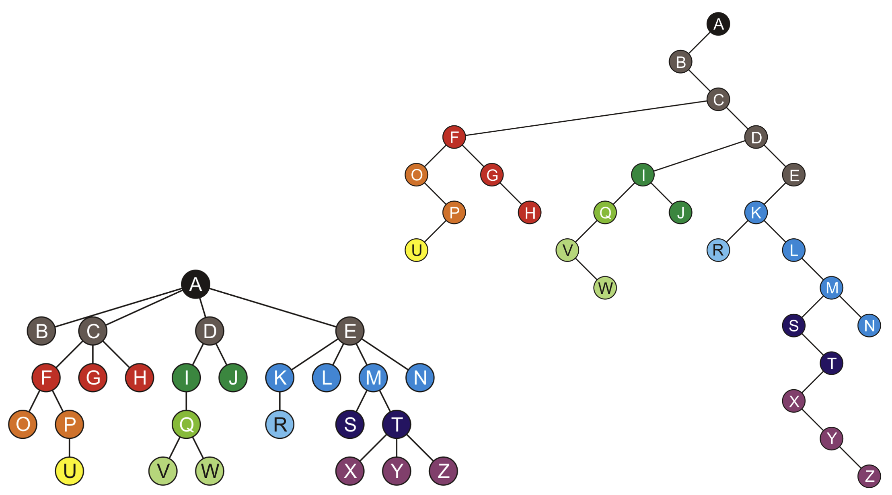
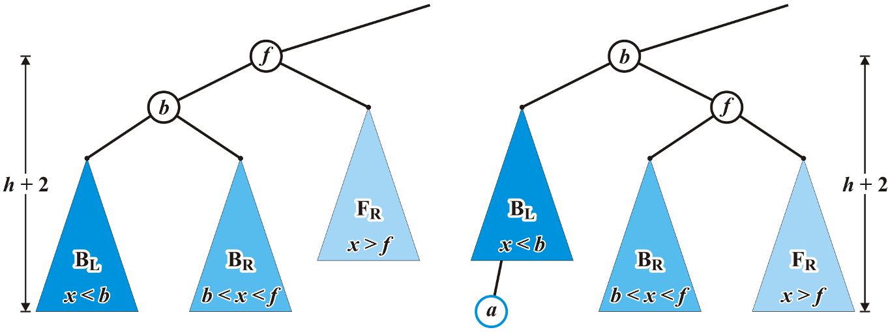
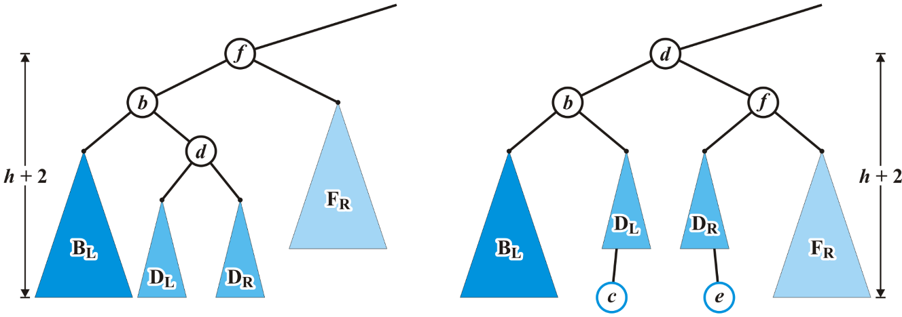
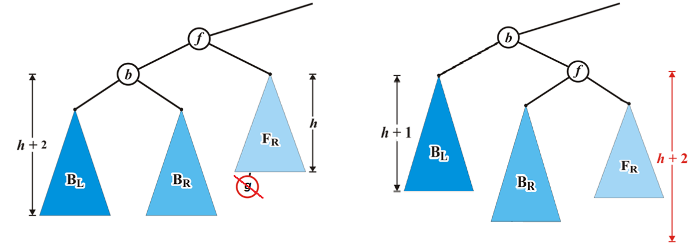

# Abstruct Data Type

## Array & Linked list

### Array

- Data are stored continuously in memory.

- Often fixed size. (**but not for dynamic array**)

|Operation|Time|
|---|---|
|insert|$O(n)$|
|remove|$O(n)$|
|access|$\blue{O(1)}$
|find|$O(n)$|

### Linked List

- Each data is stored in a *node* scattered in memory.

- Can be easily extended.

- Use more space to store pointers to next.

#### Singly Linked List

```cpp
class Node {
private:
  int val;
  Node *next;
public:
  Node(int = 0, Node* = nullptr);

  int retrieve() const;
  Node *next() const;

  void push_front();
  int pop_front();
}
```

|Operation|Time|
|---|---|
|insert|$\blue{O(1)}$|
|remove|$\blue{O(1)}$|
|access|$O(n)$|
|find|$O(n)$|

### Doubly Linked List

```cpp hl_lines="4"
class Node {
private:
  int val;
  Node *previous;
  Node *next;
public:
  Node(int = 0, Node* = nullptr);

  int retrieve() const;
  Node *next() const;

  void push_front();
  int pop_front();
}
```

### Circular Linked List

- The last node stores the pointer to the head node.

## Stack & Queue

### Stack

> Reverse-Polish Notation
>
> - No ambiguity and no brackets are required.
> - Realized by stack.

The stack can be implemented using either an **array** or a **linked list** (`std::deque` in C++)

- Follows the principle of Last-In-First-OUT.
- `push()` to add element to the top of stack & `pop()` to remove the top element.
- ALL implemented in $O(1)$.

```cpp
class ArrayStack {
private:
  std::vector<int> stack;

public:
  int size() const;
  bool empty() const;
  
  void push(int val) {
    stack.push_back(val);
  }
  int pop() {
    int num = top();
    stack.pop_back();
    return num;
  }
  int top();
};
```

```cpp
class LinkedListStack {
private:
  Node *top;
  int size;
public:
  int size() const;
  bool empty() const;

  void push(int val) {
    Node *node = new Node(val);
    node->next = top;
    top = node;
    size++;
  }
  int pop() {
    int num = top();
    Node *tmp = top;
    top = top->next;
    delete tmp;
    size--;
    return num;
  }
  int top();
};
```

|Operation|Time|
|---|---|
|`push()`|$\blue{O(1)}$|
|`pop()`|$\blue{O(1)}$|
|`peek()`|$\blue{O(1)}$|

### Queue

- Follows the principle of First-In-First-OUT.
- `push()` to add element to the front of queue & `pop()` to remove the last element.

```cpp
class ArrayQueue {
private:
  int *val;
  int front;
  int size;
  int capacity;
public:
  ArrayQueue(int cap) {
    val = new int[cap];
    capacity = cap;
    front = 0;
    size = 0;
  }
  
  ~ArrayQueue() {
    delete[] val;
  }

  int capacity();
  int size();
  bool empty;

  void push(int num) {
    if (size == capacity) return;
    int rear = (front + size) % capacity;
    val[rear] = num;
    size++;
  }
  int pop() {
    int num = front();
    front = (front + 1) % capacity;
    size--;
    return num;
  }
  int front();
};
```

Implemented by circular array.

```cpp
class LinkedListQueue {
private:
  Node *front, *rear;
  int size;
public:
  LinkedListQueue() {
    front = nullptr;
    rear = nullptr;
    size = 0;
  }

  ~LinkedListQueue();

  int size();
  bool empty();

  void push(int val) {
    Node *node = new Node(val);
    if (front == nullptr) {
      front = node;
      rear = node;
    } else {
      rear->next = node;
      rear = node;
    }
    size++;
  }
  int pop() {
    int num = front();
    Node *tmp = front;
    front = front->next;
    delete tmp;
    size--;
    return num;
  }
  int front();
};
```

|Operation|Time|
|---|---|
|push()|$\blue{O(1)}$|
|pop()|$\blue{O(1)}$|
|peek()|$\blue{O(1)}$|

### Example: Maze Routing

- BFS: use queue
- DFS: use stack

## Hash Table

### Hash Table

Hash table is a higly efficient data structure.

- Establishes a mapping between keys and values.
- Load Factor: the average number of objects per bin.
$$
\lambda = \frac{n}{M}
$$
- Probability of at least one collision
$$
1 - \frac{M(M-1)\cdots(M-n+1)}{M^n}
$$

|Operation|Array|Linked List|Hash Table|
|---|---|---|---|
|insert|$O(n)$|$\blue{O(1)}$|$\blue{O(1)}$|
|remove|$O(n)$|$\blue{O(1)}$|$\blue{O(1)}$|
|access|$\blue{O(1)}$|$O(n)$|$\blue{O(1)}$|
|find|$O(n)$|$O(n)$|$\blue{O(1)}$|

### Hash Collision

If the return of `hashFunction(key)` are the same, e.g.

```
114514 % 100 = 14
145114 % 100 = 14
```

this situation is called *hash collision*.

Hash collision is inevitable because the input space is much larger than the output space.

We can reduce hash collisions by resizing the hash table, but we'd better improve the hash table data structure, since resizing a hash table is time-consuming and space-consuming.

#### Separate Chaining

Each bucket stores a linked list, containing all colliding elements.

#### Open Addressing

##### Linear Proding

If the bucket already contains an element, linearly traverse forward the conflict position to insert or search elements.

e.g. If index $n$ has already store a pair, we jump to $n+1$, if so, then $n+2$, $n+3$, etc.

##### Quadratic Proding

Similar to linear proding, if the bucket already contains an element, traverse by skipping a square of the number of prodes forward the conflict position to insert or search elements.

e.g. If index $n$ has already store a pair, we jump to $n+1$, if so, then $n+2$, $n+4$, etc.

##### Double Hashing

Uses two hash functions $h_1(k), h_2(k)$ for proding.

$$
h(k) = h_1(k) + i \cdot h_2(k)
$$

Then *Linear Proding* can be shown as $h(k) = h_1(k) + i$, where $h_2(k) = 1$

*Quadratic Proding* can also be shown as $h(k) = h_1(k) + c_1 + c_2 \cdot i$, where $h_2(k) = c_1 + c_2 \cdot i$

### Hash Algorithm

The methods given above can be used to solve hash collision. However, they cannot reduce the frequency of hash collisions. So we need to design some algorithms in order to avoid collisions.

#### Common Hash Algorithm

In practice, we usually use some standard hash algorithms, such as MD5, SHA-1, SHA-2, and SHA-3. They can map input data of any length to a fixed-length hash value.

## Tree

- All nodes will have zero or more child nodes or *children*
- For all nodes other than the root node, there is one parent node
- The *degree* of a node is defined as the number of its children.
    - Nodes with degree zero are also called ***leaf nodes***
  
- For each node in a tree, there exists a unique path from the root node to that node

- The *height* of a tree is defined as the maximum depth of any node within the tree

- Ancestor of node $n$: any node $y$ on the (unique) path from root $r$ to node $n$ is an ancestor of node $n$
- Descendent of node $n$: any node $y$ for which $n$ is an ancestor of $y$

!!! abstract "A recursive definition of a tree"
    - A degree-0 node is a tree
    - A node with degree $n$ is a tree if it has $n$ children and all of its children are disjoint trees (i.e. with no intersecting nodes)

    ??? quote "Code"
        ```cpp
        // TreeNode structure definition
        struct TreeNode {
          int value;
          std::vector<TreeNode*> children;
    
          TreeNode(int val) : value(val) {}
        };
    
        // Helper function to check if there are duplicate nodes (disjoint check)
        bool areDisjoint(TreeNode* node, std::unordered_set<TreeNode*>& visited) {
          if (visited.count(node)) return false;  // Node already visited
    
          visited.insert(node);  // Mark this node as visited
          for (TreeNode* child : node->children) {
            if (!areDisjoint(child, visited)) {
              return false;  // If any child violates the disjoint rule
            }
          }
          return true;
        }
    
        // Main function to check if the tree is valid
        bool IsTree(TreeNode* root) {
          if (root == nullptr) return true;  // Empty tree is valid
    
          std::unordered_set<TreeNode*> visited;  // To track visited nodes
          if (!areDisjoint(root, visited)) return false;  // Check disjoint condition
    
          // Verify the recursive tree structure
          for (TreeNode* child : root->children) {
            if (!IsTree(child)) return false;  // Recursively check all children
          }
          return true;
        }
        ```

### Operations

- Access the root
- Given an object in the container:
    - Access the parent of the current object
    - Find the degree of the current object
    - Get a reference to a child
    - Attach a new sub-tree to the current object
    - Detach this tree from its parent

### C++ Implementation

### Tree Traversal

#### Breadth-First Traversal

Visit all nodes at a given depth before descending a level

- Place the root node into a queue
- While the queue is not empty:
    - Pop the node at the front of the queue
    - Push all of its children into the queue

The order in which the nodes come out of the queue will be in breadth-first order

#### Depth-First Traversal

##### Pre-ordering

##### Post-ordering

### Monte Carlo Tree Search

A randomized and principled tree search method

### Binary Tree

A binary tree is a restriction where each node has exactly two children.

A full binary tree is where each node is a full node, or a leaf node.

#### Perfect Binary Tree

A ***perfect binary tree*** of height $h$ is a binary tree where

- All leaf nodes have the same depth $h$.
- All other nodes are full.

##### Theorems

- A perfect binary tree of height $h$ has $2^{h+1} - 1$ nodes.
- The height is $\Theta(\ln n)$.
- There are $2^h$ leaf nodes.
- The average depth of a node is $\Theta(\ln n)$: 

$$
\begin{aligned}
\frac{\sum_{k=0}^{h}k 2^k}{2^{h+1} - 1} &= \frac{h2^{h+1} - 2^{h + 1} + 2}{2^{h+1} - 1} = \frac{h(2^{h+1} - 1) - (2^{h+1} - 1) + 1 + h}{2^{h+1} - 1}\\
&= h - 1 + \frac{h + 1}{2^{h+1} - 1} \approx h - 1 = \Theta(\ln n)
\end{aligned}
$$

#### Complete Binary Tree

Recursive definition: a binary tree with a single node is a ***complete binary tree*** of height $h = 0$ and a complete binary tree of height $h$ is a tree where either:

- The left sub-tree is a complete tree of height $h – 1$ and the right sub-tree is a perfect tree of height $h – 2$, or
- The left sub-tree is perfect tree with height $h – 1$ and the right sub-tree is complete tree with height $h – 1$

More commonly, a complete is perfect except the last level, and the leaves in the last level are implemented from left side to the right side.

##### Theorems

- The height is $h = \left\lfloor \lg n\right\rfloor$

#### Left-Child Right-Sibling Binary Tree

Store a general tree as a binary tree.



### *Huffman Code

Reduce size of data.

- Going left if a $0$
- Going right is a $1$
- Code word is only completed when a leaf node is reached.


### Binary Search Tree

- All objects in the left sub-tree to be less than the object stored in the root node.

- All objects in the right sub-tree to be greater than the object in the root object.

- The two sub-trees are themselves binary search trees.


#### Implementation

- `print()`

    In-order traversal

- `insert()`

- `erase()`

### AVL Tree

A BST can easily degenerate into a linked list in some cases. In order to take advantage of BST properties, we need some operations to keep it balanced.

All operations are in $O(\log n)$

#### Cases

##### Case 1



##### Case 2



##### Case 3 (Only happen when erasing nodes)

Do the same as in Case 1 when erasing a node.



## Heap

### Binary Heap

A non-empty tree is a min-heap if

- The key associated with the root is less than or equal to the keys associated with the sub-trees (if any)
- The sub-trees (if any) are also min-heaps

|Operation|Time|
|---|---|
|`push()`|$O(\log n)$|
|`pop()`|$O(\log n)$|
|`peek()`|$\blue{O(1)}$|

#### Array Implementation

Start at index 1 when filling the array.

Given the entry at index k, it follows that:

- The parent of node is a $k/2$
- The children are at $2k$ and $2k + 1$

## Disjoint Set

- Worst case: $O(\log n)$ (or $O(n)$ without optimization)
- Average case: $O(\alpha (n))$
- Best case: $\Theta(1)$

!!! quote "About $\alpha (n)$"

    $\alpha(n)$ is the inverse of the function $A(i,j)$, that is
    
    $$
    \alpha (n) = \min \{i \mid A(i, i)\geq n\}
    $$
    
    where $A(i,j)$ is the Ackermann function
    
    $$
    A(i,j) =
    \begin{cases}
    j+1, &i=0\\
    A(i-1,1), &i>0, j=0\\
    A(i-1, A(i, j-1)), &i>0, j>0
    \end{cases}
    $$

#### Implementation

- `find(i)`

    - Find the root element of the tree that contains `i`.

- `set_union(i, j)`

    - Find the root elements of `i` and `j`.
    - Update the parent of one root element to be the other root element.

#### Optimization 1: Union-by-rank

When two trees have the same height, the set specified first in the union will be the root of the merged set.

- Point the root of the shorter tree to the root of the taller tree.
- The height of the taller will increase if and only if the trees are equal in height.

#### Optimization 2: Path compression

The set specified first in the union will always be the root of the merged set.

```cpp
size_t Disjoint_set::find(size_t n) {
  if (parent[n] == n) {
    return n;
  } else {
    parent[n] = find(parent[n]);
    return parent[n];
  }
}
```

