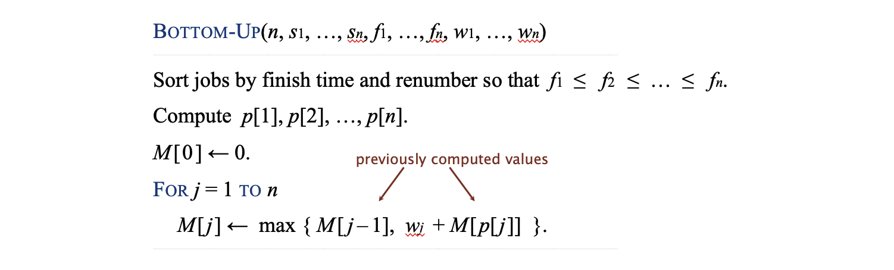

# Dynamic Programming

!!! quote "Fibonacci Numbers"

	Consider this function

	```cpp
	double F(int n) {
		return (n <= 1) ? 1.0 : F(n - 1) + F(n - 2);
	}
	```
	The run-time of this algorithm is

	$$
	T(n) = 
	\begin{cases}
	\Theta(1), &n \leq 1 \\
	T(n - 1) + T(n - 2) + \Theta(1), &n > 1
	\end{cases}
	$$

	So $T(n) = O(2^n)$.

	The problem is we need to call the function with some small inputs for millions of times.

	And here is a possible solution:

	- To avoid calculating values multiple times, store intermediate calculations in a table.
	- When storing intermediate results, this process is called *memoization* (The root is *memo*).
	- We save (memoize) computed answers for possible later reuse, rather than re-computing the answer multiple times.
	


## Definition

In solving optimization problems, the top-down approach may require repeatedly obtaining optimal solutions for the same sub-problem.

Dynamic programming is distinct from divide-and-conquer, as the divide-and-conquer approach works well if the sub-problems are essentially unique.
- Storing intermediate results would only waste memory.

If sub-problems re-occur, the problem is said to have overlapping sub-problems.

- Break up a problem into a series of overlapping subproblems.
- Combine solutions to smaller subproblems to form solution to large subproblem.

## Solve

#### 1. Problem Analysis

- Understand the problem requirements: identify the goal and find the optimal solution.

- Analyze the problem scale and break it into subproblems.

- Ensure the problem satisfies these two properties:

	1. Optimal Substructure: The solution of a problem can be composed of the solutions of its subproblems.

	2. Overlapping Subproblems: Subproblems are solved multiple times.

#### 2. Define State and Variables

- Clearly define the `dp[i]` state.

	- Example: `dp[i]` represents the number of ways to reach the ith step.

- Determine the valid range of states (boundary conditions).

#### Establish State Transition Relationship

- Derive the recursive relationship to transition from smaller problems to larger ones.

	- Example: `dp[i]` = `dp[i-1]` + `dp[i-2]` (Frog jump problem).

#### Initialize States

- Initialize the dp table or variables based on the base cases.

	- Example: `dp[0] = 1`, `dp[1] = 1`.

#### Bottom-Up Iteration

- Solve the problem iteratively starting from the smallest subproblem.
Avoid redundant calculations by storing the results of subproblems in a table or array.

#### Return the Result

- Output the result based on the final `dp` value(s).

## Examples

### Weighted Interval Scheduling

#### Description

- Job $j$ starts at $s_j$, finishes at $f_j$, and has weight $w_j  > 0$.
- Two jobs are **compatible** if they don’t overlap.
- Goal: find max-weight subset of mutually compatible jobs.

#### Solve: Brute Force

Define $p(j) = $ largest index $i < j$ such that job $i$ is compatible with $j$, $\text{OPT}(j) = $ max weight of any subset of mutually compatible jobs for subproblem consisting only of jobs $1, 2, \dots, j$.

- Case 1: $\text{OPT}(j)$ does not select job $j$.

	$$
	\text{OPT}(j) = \text{OPT}(j-1)
	$$

- Case 2: $\text{OPT}(j)$ selects job $j$.

	- Collect profit $w_j$.
	- Can't use incompatible jobs $\{p(j) + 1, p(j) + 2, \dots, j -1\}$
	- Must include optimal solution to problem consisting of remaining compatible jobs $1, 2, \dots, p(j)$.

	$$
	\text{OPT}(j) = w_j + \text{OPT}(p(j)
	$$

So

$$
\text{OPT}(j) = \max{(\text{OPT}(j-1), w_j + \text{OPT}(p(j)))}
$$

#### Solve: Memoization (Top-down)


- Cache result of subproblem $j$ in $M[j]$.
- Use $M[j]$ to avoid solving subproblem $j$ more than once.

- Time Complexity: $O(n)$

#### Solve: Bottom-up



- Time Complexity: $O(n \log n)$

### Segmented Least Squares

### Knapsack Problem