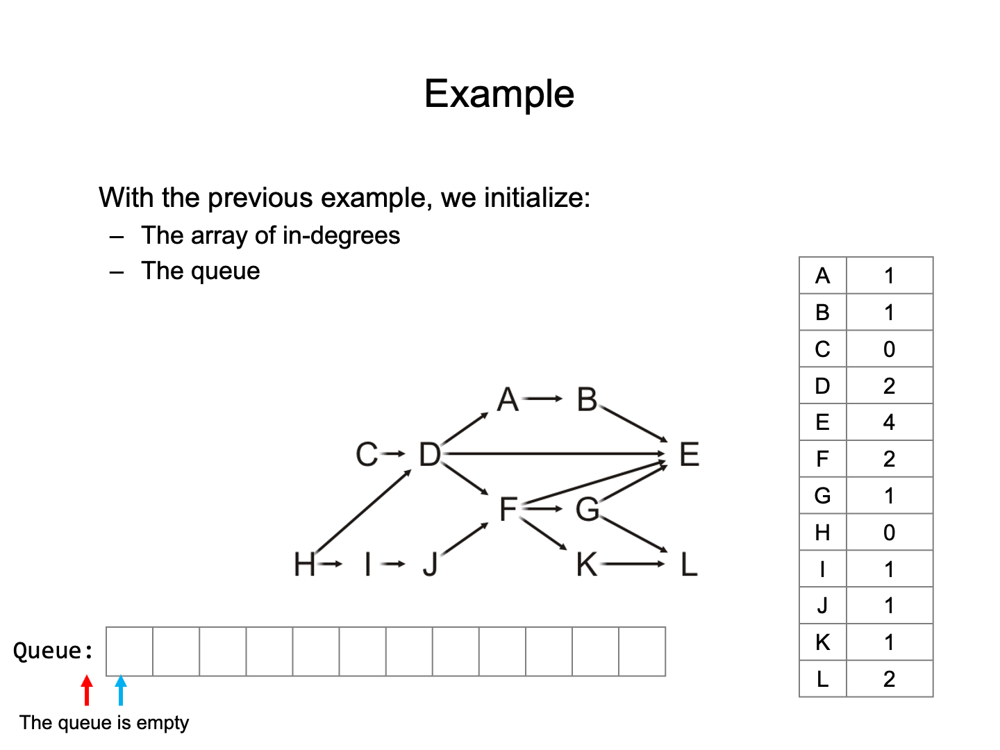
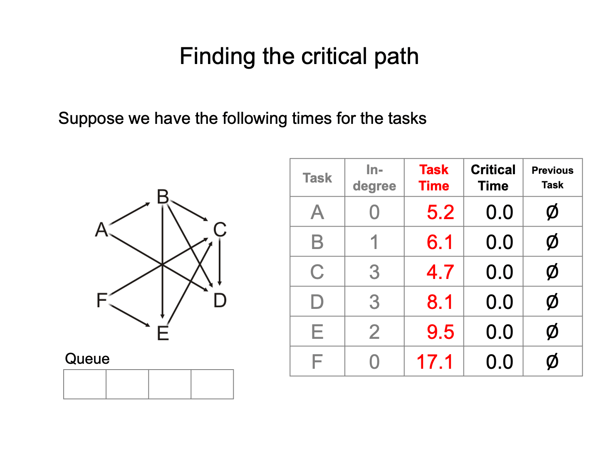

# Graph

## Undirected Graphs

### Definitions

##### Undirected Graph

$$
V = \{v_1, v_2, \dots , v_n\}
$$

$$
E = \{\{v_i, v_j\}\mid v_i, v_j\text{ are connected}\}
$$

- The number of the vertices is $|V| = n \leq \frac{n(n-1)}{2} = O(n^2)$.

##### Degree

The **degree** of a vertex is the number of adjacent vertices.

##### Sub-graphs

A sub-graph of a graph contains a subset of the vertices and a subset of the edges in original graph.

##### Vertex-induced sub-graphs

A vertex-induced sub-graph contains a subset of the vertices and all the edges in the original graph between those vertices.

##### Path

$$
(v_0, v_1, \dots , v_k)
$$

##### Simple path

A simple path has no repetitions.

##### Simple cycle

A simple cycle is a simple path of **at least two vertices** with the first and last vectices equal.

##### Connectedness

$v_i, v_j$ are connected if there exists a path from $v_i$ to $v_j$.

- Two nodes are strongly connected if there exists multiple path from one to the other.

- Two nodes are weakly connected if there is only one path.

##### Weighted graphs

##### Trees

A graph is a tree if it is connected and there is a unique path between any two vertices.

##### Forests

A forest is any graph that has no cycles.

## Directed Graphs

### Definitions

##### Directed Graph

The edges on a graph are be associated with a direction.

##### In and Out degrees

- The out-degree of a vertex is the number of outward edges from the vertex

- The in-degree of a vertex is the number of inward edges to the vertex

##### Sources and sinks

- Vertices with an in-degree of zero are described as sources
- Vertices with an out-degree of zero are described as sinks

##### Connectedness

- A graph is strongly connected if there exists a directed path between any two vertices
- A graph is weakly connected there exists a path between any two vertices that ignores the direction

##### Directed acyclic graphs (DAGs)

A directed acyclic graph is a directed graph which has no cycle.

## Graph Traversal (Search)

A means of visiting all the vertices in a graph, also called searches.

Time complexity of graph traversal cannot be better than and should not be worse than $\Theta(|V| + |E|)$

- Connected graphs simplify this to $\Theta(|E|)$
- Worst case: $\Theta(|V|^2)$

### Breadth-first traversal (BFS)

- Choose any vertex, mark it as visited and push it onto queue.

- While the queue is not empty:

	- Pop the top vertex $v$ from the queue.
	- For each vertex adjacent to $v$ that has not been visited:

		- Mark it visited and push it onto the queue.

- The size of the queue is $O(|V|)$.

#### Implementation

```cpp
void Graph::breadth_first_traversal(Vertex *first) const {
	unordered_map<Vertex *, int> hash;
	hash.insert(first);
	std::queue<Vertex *> queue;
	queue.push(first);

	while (!queue.empty()) {
		Vertex *v = queue.front();
		queue.pop();
		// Perform an operation on v

		for (Vertex *w : v->adjacent_vertices()) {
			if (!hash.member(w)) {
				hash.insert(w);
				queue.push(w);
			}
		}
	}
}
```

### Depth-first traversal (DFS)

- Choose any vertex, mark it as visited.

- From that vertex:

  - If there is another adjacent vertex not yet visited, go to it.
  - Otherwise, go back to the previous vertex.

- Continue until no visited vertices have unvisited adjacent vertices.

```cpp
void Vertex::depth_first_traversal() const {
  for (Vertex *v : adjacent_vertices()) {
    if (!v->visited()) {
      v->mark_visited();
      v->depth_first_traversal();
    }
  }
}
```

## Bipartite Graphs

#### Definition

A bipartite graph is a graph where the vertices $V$ can be divided into two disjoint sets $V_1$ and $V_2$ such that **every** edge has one vertex in $V_1$ and the other in $V_2$.


Use a breadth-firsgt traversal to determine if it's a bipartite graph.

## Minimum Spanning Tree

Given a connected graph with $n$ vertices, a spanning tree is defined as a subgraph that is a tree and includes all the $n$ vertices.


#### Definition

The spanning tree with the minimum weight.

### Prim's algorithm (Adding vertices)

- Start with an arbitrary vertex to form a MST on one vertex as the root.
- At each step, add the edge with least weight that connects the current MST to a new vertex.
- Continue until we have $n-1$ edges and $n$ vertices.

#### Analysis

- Time complexity: $\Theta(|V|^2 + |E|)$

We can use a binary heap or fib to find the shortest edge in each iteration.

- Using binary heap: $O((|V|+|E|)\ln(|V|)) = O(|E|\ln(|V|))$
- Using Fibonacci heap: $O(|E|+|V|\ln(|V|))$

### Kruskal's algorithm (Adding edges)

- Sort the edges by weight.
- Create a disjoint set of the vertices.
- Go through the edges from least weight to greatest weight.
	- Add the edges to the spanning tree so long as the addition does not create a cycle.

- Repeatedly add more edges until:
	- $|V| - 1$ edges have been added, then we have a minimum spanning tree.
	- Otherwise, if we have gone through all the edges, then we have a forest of minimum spanning trees on all connected sub-graphs.

#### Analysis

!!! question "How do we determine if a cycle would be created?"

	We could use disjoint sets.

	- Consider edges in the same connected sub-graph as forming a set.
	- If the vertices of the next edge are in different sets, take the union of the two sets.
	- Do not add edge if both vertices are in the same set.

- Time complexity: $O(|E|\ln(|E|))$

### Additional Theorem

!!! quote "How to find the number of spanning trees of a specific graph?"

1. Form the Laplacian matrix $L$.
	- $L[i][i] = $ Degree of vertex $i$.
	- $L[i][j] = -1$ if there is an edge between vertices $i$ and $j$, and $0$ otherwise.

2. Create the reduced Laplacian matrix $L'$.
	- Remove any one row and the corresponding column from $L$.

3. Calculate the determinant of $L'$.
	- The determinant of $L'$ gives the number of spanning trees of the graph.

!!! quote "How do we know the range of an edge in $G$?"

!!! abstract "Cut Property"
	- An edge in the Minimum Spanning Tree (MST) must be the smallest-weight edge (or one of them) in some cut of the graph.
	- If the weight of an edge in the MST is modified, it must still remain the smallest-weight edge in that cut.

!!! abstract "Cycle Property"
	- If an edge outside the MST is added to the MST, it will form a cycle.
	- If the weight of this edge is smaller than that of any edge in the cycle, it will replace the heaviest edge in the cycle, thereby altering the structure of the MST.

Therefore, for any edge $e$ in $G$, we can consider two situations:

1. If $e$ is in the MST,

	- We generally delete $e$ in the MST, dividing the MST into two parts.
	- Then find all the edges that can connect these two parts.
	- The maximum weight of $e$ is not greater than the minimum weight in these edges.
	
2. If $e$ is not in the MST,

	- We generally add $e$ to the MST, creating a cycle in the MST.
	- The minimum weight of $e$ is not lesser than the maximum weight in this cycle. (except $e$ itself)

## Topological Sort

#### Definition

- A graph is a DAG if and only if it has a topological sorting.

Lemmas:

- A DAG always has at least one vertex with in-degree zero.
- Any sub-graph of a DAG is a DAG

#### Algorithm

Given a DAG $V$, iterate:

- Find a vertex $v$ in $V$ with in-degree zero.
- Let $v$ be the next vertex in the topological sort.
- Continue iterating with the vertex-induced sub-graph $V\backslash \{v\}$

> Note that topological sorts need **not be unique**.

#### Analysis

- Use a queue (or other container) to temporarily store those vertices with in-degree zero.
- Each time the in-degree of a vertex is decremented to zero, push it onto the queue.

#### Implementation

To implement a topological sort:

- Allocate memory for and initialize an array of in-degrees.
- Create a queue and initialize it with all vertices that have in-degree zero.

While the queue is not empty:

- Pop a vertex from the queue.
- Decrement the in-degree of each neighbor.
- Those neighbors whose in-degree was decremented to zero are pushed onto the queue.



### Example: Critical Path

The **critical time** of each task is the earliest time that it could be completed after the start of execution.

The **critical path** is the sequence of tasks determining the minimum time needed to complete the project.

- If a task on the critical path is delayed, the entire project will be delayed.

#### Find the critical path

To find the critical time/path, we run topological sorting.

Each time we pop a vertex $v$, in addition to what we already do:

- For $v$, add the task time onto the critical time for that vertex:

	- That is the critical time for $v$.

- For each <u>adjacent</u> vertex $w$:

	- If the critical time for $v$ is greater than the currently stored critical time for $w$.

		- Update the critical time with the critical time for $v$.
		- Set the previous pointer to the vertex $v$.



## Shortest Path

Given a weighted directed graph, one common problem is finding the shortest path between two given vertices.

### Dijkstra's Algorithm

#### Process

!!! quote "Description"

	Dijkstra's algorithm solves the single-source shortest path problem.

	- It is very similar to Prim's algorithm.
	- Assumption: ==all the weights are positive==.

We will iterate $|V|$ times:

- Find the unvisited vertex $v$ that has a minimum distance to it.
- Mark it as visited.
- Consider its every adjacent vertex $w$ that is unvisited:

	- If the distance to $v$ plus the weight of the edge $(v,w)$ less than our currently known shortest distance to $w$, update the shortest distance to $w$.

Continue iterating until all vertices are visited or ==all remaining vertices have a distance of infinity==.

#### Analysis

- Use a binary heap: $O(|E|\ln (|V|))$
- Use a Fibonacci heap: $O(|E| + |V|\ln (|V|))$

### Bellman-Ford Algorithm

!!! quote "Description"

	How to solve if there exists negative weight?

	Assumption: For graphs with negative weights (but no cycles with negative weight)

#### Process

Basic idea:

$$
\text{dist}[v] = \min \{\text{dist}[v], \text{dist}[u] + w(u,v)\}
$$

That is, for each edge $(u,v)\in E$, if $\text{dist}[v] > \text{dist}[u] + w(u,v)$,

$$
\text{dist}[v] = \text{dist}[u] + w(u,v)
$$

#### Analysis

- Time Complexity: $O(|V||E|)$

### A*

#### Idea

The A* search algorithm initially:

- Marks each vertex as unvisited.
- Starts with a priority queue containing only the initial vertex $a$.

	- The priority of any vertex $v$ in the queue is the weight $w(v)$ which assumes we have found the shortest path to $v$ (initialize it to be infinity except for the initial vertex $a$).
	- Shortest weights have highest priority.

- For each vertex $v$, $d(a, v)$ is the shortest known distance from $a$ to $v$, $d(a, a) = 0$ and $d(a, v)= \infty$ for all $v \neq a$.
- For each vertex $v$, $h(v, z)$ is the heuristic distance from $v$ to $z$.

#### Process (==Graph Search==)

The algorithm then iterates:

- Pop the vertex $u$ with highest priority.

	- Mark $u$ as visited. (not require in tree traversal)

- For each unvisited adjacent vertex (neighbor) v of u:

	- If $w(v) = d(a, u) + d(u, v) + h(v, z)$ is less than the current weight/priority of $v$, update the path leading to $v$ and its priority
	- If $v$ is not in the queue, push $v$ into the queue 

Continue iterating until the item popped from the priority queue is the destination vertex $z$

#### Comparison with Dijkstra's Algorithm

- Dijkstra's algorithm radiates out from the initial vertex.
- The A* search algorithm directs its search towards the destination

Dijkstra’s algorithm is the A* search algorithm when 

$$
	h(u,v) = 
	\begin{cases}
	0, &u = v\\
	1, &u\neq v
	\end{cases}
$$


The A* search algorithm will not always find the optimal path with a poor heuristic distance.

#### Analysis

- Exponential: $O(b^d)$ where $b$ is the branching factor (the average number of successors per state) and $b$ is the depth of the solution.

- Can be shown to run in polynomial time if 

	$$
	|h(u, v) - d(u, v)| = O(\ln (d(u, v)))
	$$

	where $d(u, v)$ is the length of the actual shortest path.

### Floyd-Warshall

#### Idea

!!! quote "Find the shortest path for all pairs of vertices"

	If we want to find the shortest path between all pairs of vertices, we could apply Dijkstra's algorithm to each vertex.

	- Runtime: $O(|V||E|\ln(|V|))$

	If $|E| = \Theta(|V|^2)$, runnning Dijkstra for each vertex is $O(|V|^3 \ln(|V|))$.

!!! question "Question"

	For the worst case, can we find a $o(|V|^3 \ln(|V|))$ algorithm?

We will look at the Floyd-Warshall algorithm.

- It works with positive or negative weights with no negative cycle.

#### Process

First, initialize the adjacent matrix:

$$
d_{i,j}^{(0)} = 
\begin{cases}
0, &\text{If }i = j\\
w_{i,j}, &\text{If there is an edge from }i\text{ to }\\
\infty, &\text{Otherwise}
\end{cases}
$$

```cpp
// Initialize the matrix d
// ...

for ( int k = 0; k < num_vertices; ++k ) {
  for ( int i = 0; i < num_vertices; ++i ) {
    for ( int j = 0; j < num_vertices; ++j ) {
      d[i][j] = std::min( d[i][j], d[i][k] + d[k][j] );
    }
  }
}
```

#### Analysis

- Run time: $\Theta(|V|^3)$

!!! question "What is the Shortest Path?"

	This algorithm finds the shortest distances, but what are the paths corresponding to those shortest distances?

Let's store the next vertex in the shortest path, Initially:

$$
p_{i,j} =
\begin{cases}
\empty, &\text{If }i = j\\
j, &\text{If there is an edge from }i\text{ to j}\\
\empty, &\text{Otherwise}
\end{cases}
$$

```cpp hl_lines="8"
// Initialize the matrix p,d
// ...

for ( int k = 0; k < num_vertices; ++k ) {
  for ( int i = 0; i < num_vertices; ++i ) {
    for ( int j = 0; j < num_vertices; ++j ) {
      if ( d[i][j] > d[i][k] + d[k][j] ) {
        p[i][j] = p[i][k];
        d[i][j] = d[i][k] + d[k][j];
      }
    }
  }
}
```

!!! question "Which Vertices are Connected?"

	What if we only care if a connection exists?

```cpp hl_lines="10"
bool tc[num_vertices][num_vertices];

// Initialize the matrix tc: Theta(|V|^2)
// ...

for ( int k = 0; k < num_vertices; ++k ) {
  for ( int i = 0; i < num_vertices; ++i ) {
    for ( int j = 0; j < num_vertices; ++j ) {
      if ( d[i][j] > d[i][k] + d[k][j] ) {
		tc[i][j] = tc[i][j] || (tc[i][k] && tc[k][j]);
      }
    }
  }
}
```