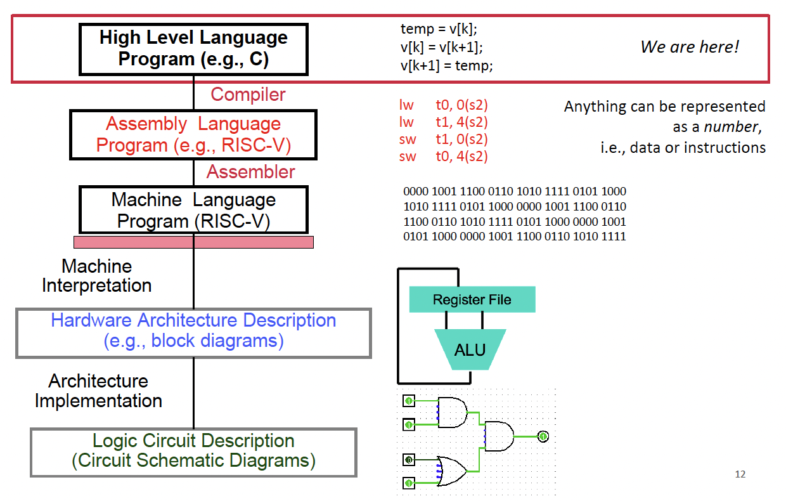
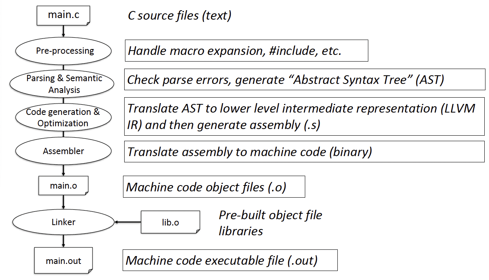

# C Language

## Introduction to C

### How C works?

- Excellent run-time performance: generally much faster than Pythonor Java for comparable code (because it optimizes for a given architecture)

- Reasonable compilation time: enhancements in compilation procedure (Makefiles) allow only modified files to be recompiled

- Mainstream C compiler in Linux:

	- GNU Complier Collection (gcc, not only for C family)

	- clang/LLVM (for C language family)

	- In terminal/command line tool/shell, “man clang/gcc”

### C Pre-Processing (CPP)

- C source files first pass through CPP, before compiler sees code (mainly text editing)

- CPP replaces comments with a single space.

- CPP commands begin with `#`.

### Macro

- `#include “file.h” /* Inserts file.h into output */`
- `#include <stdio.h> /* Looks for file in standard location */`
- `#define M_PI (3.14159) /* Define constant */`
- `#if/#endif /* Conditional inclusion of text */`

- Text replacement.
- Avoid using macros whenever possible.
- NO or very tiny speedup.
- Instead use C function.

### C Compilation

---

## C Memory Management

### Pointer

<!-- TODO: Implement -->

### Array

<!-- TODO: Implement -->

### Pointer Arithmetic

- Hardware’s memory composed of 8-bit storage cells, each has a unique address.
- A C pointer is just abstracte memory address.
- Type declaration tells compiler how many bytes to fetch on eacch access through pointer.
- Alignment: Store the data in lines that can be divided by its size.
- `pointer + 1` equals to adding `1 * sizeof(type)` to the memory address.

#### `sizeof()` Operator

- `sizeof(type)` *returns*[^1] number of bytes in object.

[^1]: `sizeof()` is a operator, not a function.

### Memory Management

- A program's address space contains 4 regions:

	- **stack**: local variables inside functions, grows downward.
	- **heap**: space requested for dynamic data via malloc(); resizes dynamically, grows upward.
	- **static data**: variables declared outside functions, does not grow or shrink. Loaded when program starts, can be modified.
	- **code** (a.k.a. text): loaded when program starts, does not change.
	- 0x0 unwritable/unreadable (NULL pointer).

#### The Stack

- Every time a function is called, a new "stack frame" (**contiguous** blocks of memory; stack pointer indicates start of stack frame) is allocated on the stack, includes:
	- Return address
	- Arguments
	- Space for local variables

#### Managing the Heap

- The heap is dynamic memory – memory that can be allocated, resized, and freed during program runtime.

- C supports four functions for heap management:
	- `malloc()`: allocate a block of uninitialized memory
	- `calloc()`: allocate a block of zeroed memory
	- `free()`: free previously allocated block of memory
	- `realloc()`: change size of previously allocated block (might move)