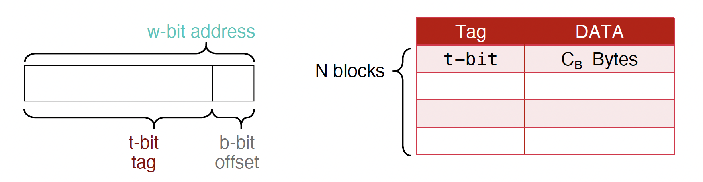
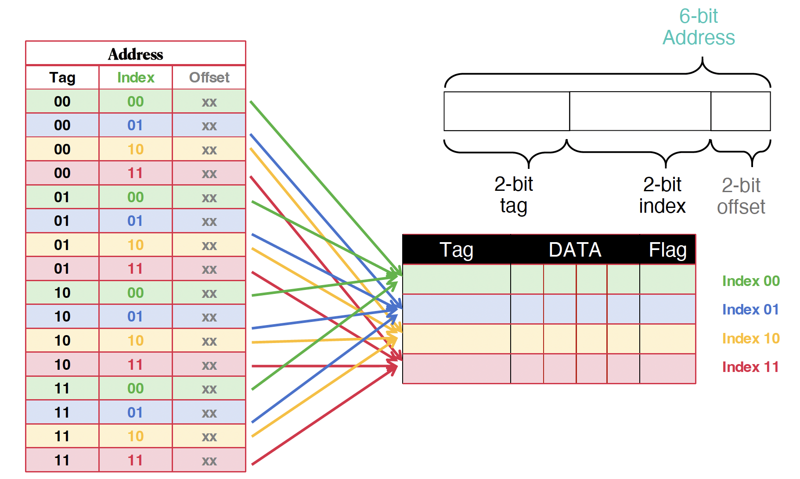
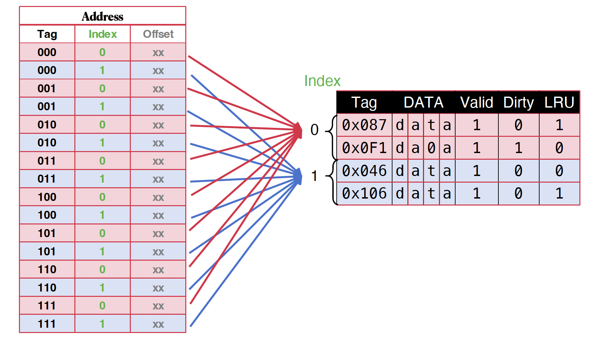

# Cache

## Intro

### DRAM & SRAM

- Dynamic Random Access Memory as main memory

## Locality

- Temporal locality (locality in time)
	- If a memory location is referenced, then it will tend to be referenced again soon

- Spatial locality (locality in space)
	- If a memory location is referenced, the locations with nearby addresses will tend to be referenced soon

#### Principle of Locality

- Programs access small portion of address space at any instant of time (spatial locality) and repeatedly access that portion (temporal locality)

#### Bane of Locality: Pointer Chasing

- Special data structures: linked list, tree, etc.
	- Easy to append onto and manipulate...

- But they have horrid locality preferences
	- Every time you follow a pointer it is to an unrelated location: No spacial reuse from previous pointers
	- And if you don't chase the pointers again you don't get temporal reuse either

## Simple Cache

- With cache, the datapath/core does not directly access the main memory;
- Instead the core asks the caches for data with improved speed;
- A hardware cache controller is deviced to provide the desired data

=== ":material-lightbulb: Memory without Cache"

	1. Processor issues address `0x12F0` to memory
	2. Memory reads `1234` @ address `0x12F0`
	3. Memory sends `1234` to Processor
	4. Processor loads `1234` into register `t0`

=== ":material-lightbulb-on: Memory with Cache"

	1. Processor issues address `0x12F0` to memory
	2. Cache checks if data @address `0x12F0` is in it
		- if it is in the cache, cache hit and read `1234`
		- if not matched, called cache miss and
			- Cache sends address `0x12F0` to memory
			- Memory read address `0x12F0` and send `1234` to cache
			- Due to limited size, cache replaces some data with `1234`
	3. Cache sends `1234` to Processor
	4. Processor loads `1234` into register `t0`

#### Typical Values

- L1 cache
	- size: tens of KB
	- hit time: complete in one clock cycle
	- miss rate: 1% to 5%

- L2 cache
	- size: hundreds of KB
	- hit time: few clock cycles
	- miss rate: 10% to 20%

- The L2 miss rate is *the fraction of L1 misses that also miss in L2*.

#### Cache Terminology

- Cache line/block: a single entry in cache
- Cache line/block size: #byte per cache line/block
- Capacity: total #byte that can be stored in a cache

#### Cache "Tag"

- We need a wag to tell if the cache have copy of location in memory so that can decide on hit or miss;
- On cache miss put memory address of block in "tag address" of cache block.

!!! warning "Understanding Cache Misses: 3Cs"

	- Compulsory (cold start or process migration, 1st reference):
		- First access to block impossible to avoid; small effect for long running programs
		- Solution: increase block size (increases miss penalty; very large blocks could increase miss rate)

	- Capacity:
		- Cache cannot contain all blocks accessed by the program
		- Solution: increase cache size (may increase access time)

	- Conflict (Collision):
		- Multiple memory locations mapped to the same cache location, conflict even when the cache has not reached full capacity.
		- Solution 1: increase cache size
		- Solution 2: increase associativity (may increase access time)

## Block Replacement Policy

#### Least Recently Used (LRU)

- Replace the entry that has not been used for the longest time, i.e. has the oldest previous access.

- Pro: Temproal locality!
	- Recent past use implies likely future use

- Cons: Complicated hardware to keep track of access history

- Add extra information to record cache usage.

#### Most Recently Used (MRU)

- Replace the entry that has the newest previous access

#### First In First Out (FIFO)

- Replace the oldest line in the set (queue)

#### Last In First Out (LIFO)

- Replace the most recent line in the set (stack)

#### Random

## Cache Mapping

### Fully Associative Cache

Arbitrary memory address can go to arbitrary cache blocks.

- Cache size: total size of the cache ($C$)
- Cache block size: $C_B \to$ decides the number of offset bits ($b$)
- Number of cache blocks ($N$): $N = C / C_B$
- Bit width of memory address ($w$): 16-bit in our examples
- Bit width of tag ($t$): $t = w - b$

### Direct Mapped Cache

The data at a memory address can be stored at exactly one possible block in the cache.

- Cache capacity/size: total size of the cache ($C$)
- Cache block size: $C_B \to$ decides the number of offset bits ($o$): $2^o = C_B$
- Number of cache blocks ($N$): $N = C / C_B$
- Bit width of memory address ($w$)
- Bit width of Index ($i$): $i = \log_2(N)$
- Bit width of tag ($t$): $t = w - o - i$

### Set Associative Cache

The data can only be stored at one index, but there are multiple slots/blocks.

- Cache capacity/size: total size of the cache ($C$)
- Cache block size: $C_B \to$ decides the number of offset bits ($o$): $2^o = C_B$
- Number of cache blocks ($M$): $M = C / C_B$
- Bit width of memory address ($w$)
- $N$-way SA cache: $N$ cache blocks in a set
- Number of sets ($S$): $S = M / N$
- Bit width of Index ($i$): $i = \log_2(S) = \log_2(M / N)$
- Bit width of tag ($t$): $t = w - o - i$
- Given $N$-way, $t$, $i$, and $o$, total capacity = $2^o * 2^i * N$

|Feature|Direct Mapped|Set Associative|Fully Associative|
|---|---|---|---|
|Hit time|Fast|Mid|Slow|
|Miss rate|High|Mid|Low|
|Miss penalty|$\sim$|$\sim$|$\sim$|

## Write Policy

!!! tip "Write Policy"

	- Store instructions write to memory, which changes values.
	- Hardware needs to ensure that cache and memory have consistent information.

	Write hit:

	=== "Write-Through"
		- Write to both cache and memory at the same time.
		- (more writes to memory $\to$ longer time)

	=== "Write-Back"
		- (not the "Write back" phase in pipeline)
		- Write data in cache and set a dirty bit to 1.
		- When this block gets replaced from the cache (and "back" to memory), write to memory.

	Write miss:

	=== "Write-Allocate"
		- Allocate in cache a space to deal with this write (cache block replacement)
		- Update LRU
		- Set dirty bit and implement write-back policy; or write-through

	=== "No-Write-Allocate"
		- The data is directly written to the main memory without loading it into the cache.

## Cache Performance & Metrics

- Hit rate: fraction of accesses that hit in the cache
- Miss rate: 1 – Hit rate
- Miss penalty: time to replace a line/block from lower level in memory hierarchy to cache
- Hit time: time to access cache memory (including tag comparison)

### AMAT

!!! abstract "AMAT: Single-Level Cache"

	**Average Memory Access Time (AMAT)** is the average time to access memory considering both hits and misses in the cache.

	$$
	\text{AMAT} = \text{Hit Time} + \text{Miss rate} \times \text{Miss penalty}
	$$

!!!	abstract "AMAT: Multi-Level Cache"

	$$
	\text{L}{\footnotesize\text{1}}\text{ AMAT} = \text{L}{\footnotesize\text{1}} \text{ Hit Time} + \text{L}{\footnotesize\text{1}} \text{ Miss rate} \times  \text{L}{\footnotesize\text{2}} \text{ AMAT}
	$$

	$$
	\text{L}{\footnotesize\text{2}} \text{ AMAT} = \text{L}{\footnotesize\text{2}} \text{ Hit Time} + \text{L}{\footnotesize\text{2}} \text{ Miss rate} \times \text{Miss penalty}
	$$

- Local miss rate: the fraction of references to one level of a cache that miss
- Global miss rate: the fraction of references that miss in all levels of a multilevel cache

### Improve Cache Performance

- Reduce hit time: use smaller cache but may increase miss rate (capacity misses)

- Reduce miss rate:
	- Program dependent;
	- Larger capacity (may decrease capacity miss but increase hit time and hardware cost);
	- Higher associativity (may reduce conflict miss; but require extra considertaion for replacement policy and increase hardware cost)
	- Larger cache blocks (may reduce compulsory miss; better spatial locality usage; but may harm temporal locality with recently-used data evicted)

- Reduce miss penalty:
	- Prefetch
	- Increase level of cache
	- Victim cache