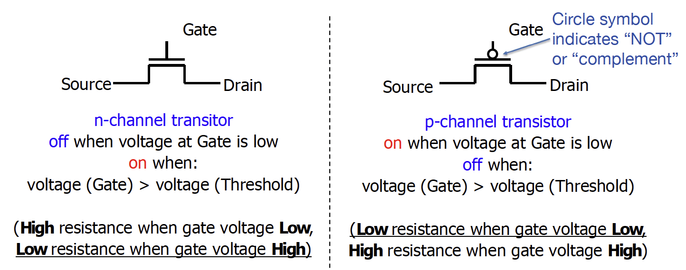

# Digital Circuits and Systems

## Digital System

#### Revisit: Binary System

- 0 and 1 (binary digit or bit, unit of information entropy)
- Decided by the characteristic of semiconductor devices (bi-stable states)

	- They can also be considered as voltage-controlled switches

- Resilient to noise (threshold)
- Supported by Boolean algebra theory (George Boole, 1854)
- Basic operations: ^, |, ~ (Universal set)

#### NMOS & PMOS Transistors

- Three terminals: source, drain, gate

- N-type transistor (NMOS) pass weak 1 (Vdd - Vth) and strong 0
- P-type transistor (PMOS) pass weak 0 (Vdd - Vth) and strong 1
- Pairs of N/P-type transistors to pass strong 0 and strong 1

## Combinational Logic

### From Logic Gates to Digital Circuits

#### Boolean Algebra

Combinational circuits: the ones that the output of the digital circuits depends solely on its inputs; usually built with logic gates without feedback

!!! abstract "Steps"

	- Write down truth table of the desired logic
	- Pick the lines with 1 as the output; write them down in ***Sum of Minterms (Product)*** form;
	- Simplify using Laws of Boolean algebra

#### Karnough Maps (Optional)

#### Laws of Boolean Algebra

|AND form|OR form| |
|---|---|---|
|$X\overline{X} = 0$|$X + \overline{X} = 1$|Complementarity|
|$X0 = 0$|$X + 1 = 1$|Laws of 0's and 1's|
|$X1 = X$|$X + 0 = X$|Identity|
|$XX = X$|$X + X = X$|Idempotent Laws|
|$XY = YX$|$X + Y = Y + X$|Commutativity|
|$(XY)Z = X(YZ)$|$(X + Y) + Z = X + (Y + Z)$|Associativity|
|$X(Y + Z) = XY + XZ$|$X + YZ = (X + Y)(X + Z)$|Distribution|
|$XY + X = X$|$(X + Y)X = X$|Absorption|
|$\overline{XY} = \overline{X} + \overline{Y}$|$\overline{X + Y} = \overline{X}\overline{Y}$|De Morgan's Theorem|

## State Elements

### Flip-flops & Registers

#### Inside a Register

- A register can be implemented by multiple D flip-flops (DFFs).
- Each DFF has a data input (D), a clock input (CLK), and a data output (Q).

### Finite State Machine (FSM)

- Finite state machine (FSM) includes: a set of states, initial/entrance state, rules for transitioning between states, and output function.

!!! tip "Building Synchrounous Circuits"
	- Step 1: Draw finite state machine of the desired function (we ignore the initialization)
	- Step 2: Define/assign binary numbers to represent the states, the inputs and the outputs
	- Step 3: Write down the truth table (enumerate input/previous state (and current state) and their corresponding current state (and output))
	- Step 4: Use template and decide the combinational block for state transition and output logic
	- *Otherwise, we can also use simple synchronous circuit blocks to build larger synchronous circuit like for the multi-bit adder*

### Timing Constraints

- Setup Time: The period that the input should be ready before the edge.
- Hold Time: The period that the input should hold its value after the edge.
- CLK-to-Q delay: How long it takes the output to change, as measured from the rising edge of the CLK.
- Critical path: path between input/output that incurs max delay

#### Estimating the Max Frequency

$$
\text{Max Frequency} = \frac{1}{\text{Min Clock Period}}
$$

$$
t_{\text{clk-to-Q}} + t_{\text{comb}} \leq \text{min clock period} + t_{\text{setup}}
$$

