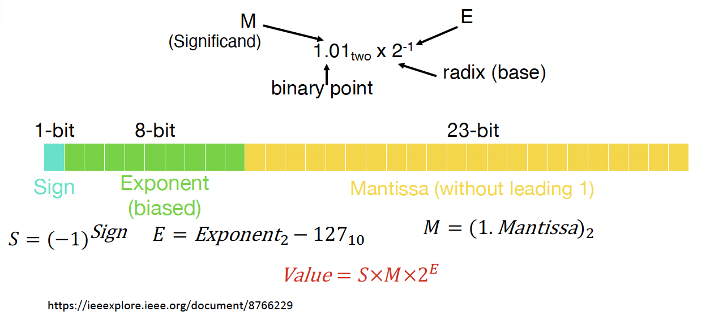

# Everything is a Number

### Signed and Unsigned Integers

#### Two's-Complement Representation (Signed Integer)

### Floating-Point Numbers

#### Single-Precision 32-bit floating point (IEEE 754)

!!! example "How to read a FP32 number?"
	
	!!! quote ""
		0 01111011 11000000000000000000000

	- Step 1: Determine the sign
		- $S = (-1)^{\text{Sign}} = (-1)^0 = 1$ (positive)

	- Step 2: Determine the unbiased exponent
		- $E = \text{Exponent}_2 - 127_{10} = 01111011_2 - 127_{10} = 123 - 127 = -4$

	- Step 3: Determine the Mantissa
		- $M = 1.\text{Mantissa}_2 = 1.11_2 = 1.75_{10}$

	- Step 4: Determine the converted decimal by using $S, E$ and $M$
		- $\text{decimal} = S \times M \times 2^E = 1 \times 1.75 \times 2^{-4} = 0.109375$

!!! example "How to store a FP32 number?"

	!!! quote ""

		0.09375 into single precision floating point

	- Step 1: Determine the sign
		- $\text{Positive} \Rightarrow \text{Sign bit} = 0$
	
	- Step 2: Convert the magnitude 0.09375 to binary
		- $0.09375_{10} = 0.00011_2$
	
	- Step 3: Convert to scientific/normalized notation to obtain mantissa and unbiased exponent
		- $0.00011_2 = 1.1_2 \times 2^{-4}$
	
	- Step 4: Determine the biased exponent and remove the leading 1 from 1.1
		- $\text{Exponent} = -4_{10} + 127_{10} = 123_{10} = 0111011_2, \text{Mantissa} = 1$

	- Step 5: Padding 0s to the end of mantissa to make up to 23 bits/truncate if more than 23 bits

	!!! quote ""
		0 01111011 100000000000000000000