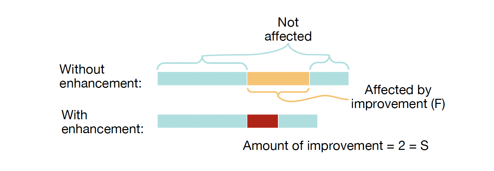

# Parallelism

### Parallelism Overview

- Parallel Requests
- Parallel Threads
- Parallel Instructions
- Parallel Data
- Hardware Descriptions
- Programming Languages

## Amdahl's Law

$$
\text{Execution time after improvement} = \frac{\text{Execution time affected by improvement}}{\text{Amount of improvement}} + \text{Execution time not affected}
$$

$$
\text{Speed-up} = \frac{\text{Original execution time}}{\text{Execution time after improvement}} = \frac{1}{(1 - F) + \frac{F}{S}}
$$



### Strong and Weak Scaling

- Strong scaling: when speedup can be achieved on a parallel processor without increasing the size of the problem;
- Weak scaling: when speedup is achieved on a parallel processor by increasing the size of the problem proportionally to the increase in the number of processors

## Flynn's Taxonomy

### Single Instruction Single Data (SISD)

- Sequential computer that exploits no parallelism in either the instruction or data streams. Examples of SISD architecture are traditional uniprocessor machines.
	- E.g. Our RISC-V processor up to now;
	- Superscalar is SISD because programming model is sequential

### Single Instruction Multiple Data (SIMD)

- SIMD computer exploits multiple data streams against a single instruction stream to operations that may be naturally parallelized.
	- Intel SIMD instruction extensions
	- NVIDIA Graphics Processing Unit (GPU)
	- Vector processors

### Multiple Instruction Multiple Data (MIMD)

- Multiple autonomous processors simultaneously executing different instructions on different data.
	- Multicore
	- Warehouse-scale computers (WSC)

### Multiple Instruction Single Data (MISD)

- Multiple-Instruction, Single-Data stream computer that exploits multiple instruction streams against a single data stream.
	- Rare, mainly of historical interest only
	- Some literatures categorize systolic array as MISD

## SIMD

### SIMD Architecture

- **Instruction**: One instructinon is fetched & decoded for entire operation
- **Register**: Use registers (128-bit XMM, 256-bit YMM, 512-bit ZMM) to store multiple data
- **Pipelining & Parallelism**: Data loading, ALU operation, and data storing are pipelined and parallelized
- **Special Operation Unit**: Use vector operation unit to perform SIMD operations (SSE/AVX, ARM NEON, RISC-V Vector)

### Loop Unrolling

- Unroll loop and adjust iteration rate to reveal more DLP than available in a single iteration of a loop.

```c
for (i = 1000; i > 0; i--) {
	x[i] = x[i] + s;
}
```

```c
for (i = 1000; i > 0; i -= 4) {
	x[i] = x[i] + s;
	x[i-1] = x[i-1] + s;
	x[i-2] = x[i-2] + s;
	x[i-3] = x[i-3] + s;
}
```

- Given a loop with $n$ iterations, $k$ copies of the body of the loop, and assume $n \text{ mod } k \neq 0$,
- Then we will run the loop with 1 copy of the body $n \text{ mod } k$ times, and with $k$ copies of the body $\left\lfloor \frac{n}{k} \right\rfloor $ times.

### RISC-V Vector Extension

- 32 vector registers
- Need to setup length of data and number of parallel
registers to work on before usage (`vconfig`)!
- `vflw.s`: vector float load word . stride: load a single word,
put in v1 ‘vector length’ times
- `vsetvl`: ask for certain vector length – hardware knows
what it can do (`maxvl`)!

```assembly
	# assume x1 contains size of array
	# assume t1 contains address of array
	# assume x4 contains address of scalar s
	vconfig 0x63        # 4 vregs, 32b data(float)
	vflw.s v1.s, 0(x4)  # load scalar value to v1

loop:
	vsetvl x2, x1       # will set vl and x2 both to min(maxvl, x1)
	vflw v0, 0(t1)      # will load `vl` elements out of `vec`
	vfadd.s v2, v1, v0  # do the add
	vsw v2, 0(t1)       # store result back to `vec`
	slli x5, x2, 2      # bytes consumed from `vec` (x2 * sizeof(float))
	add t1, t1, x5		# increment `vec` pointer
	sub x1, x1, x2		# subtract from total (x1) work done this iteration
	bne x1, x0, loop    # if x1 not yet zero, still work to do
```

