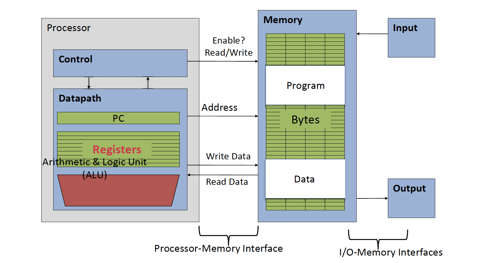
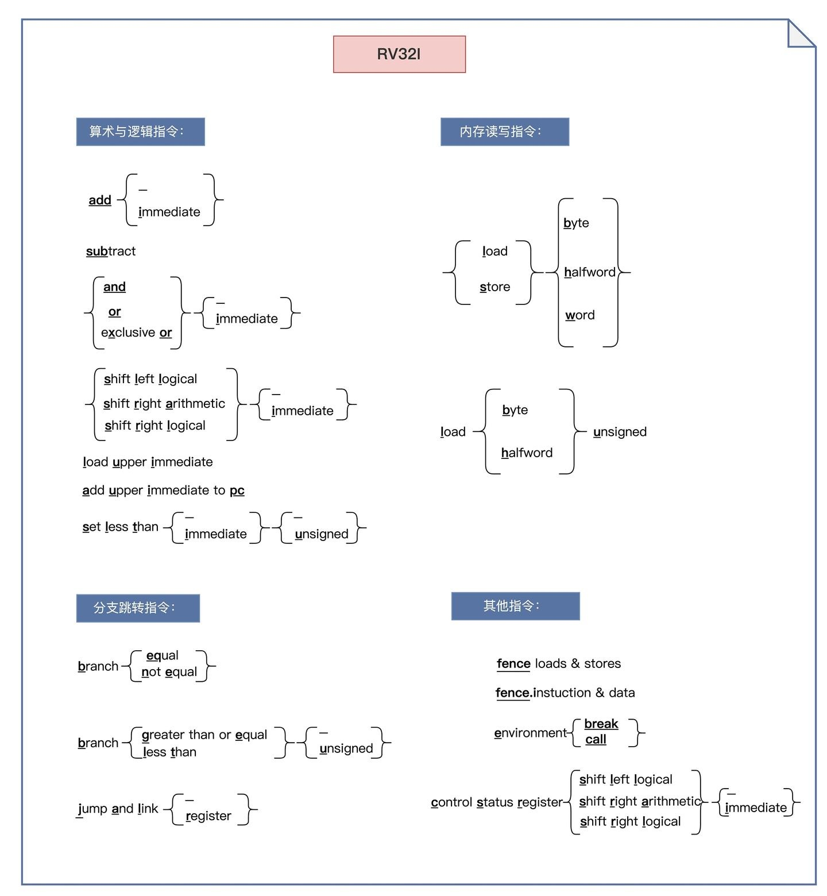
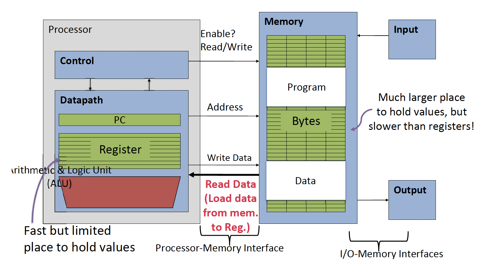

# RISC-V

### Intro to Instruction Set Architecture (ISA)

Defines the set of instructions, registers, memory access, and execution behavior for RISC-V processors.

- Arithmetic and logic operations
- Memory access: load and store
- Control flow: branches and jumps
- System calls: for I/O, etc.

#### Popular ISAs

- x86 / AMD64
- ARM
- RISC-V
	- Simple, elegant, and open-source
	- Flexible and extensible

#### Assembly Language

- Basic job of a CPU: execute a series of instructions.
- Basic job of a instruction: change the state of a computer.

#### CPU State: Assembly Registers

- Unlike C or Java, assembly cannot use variables
	- Keep assembly/computer hardware abstract simple
- Assembly operands are registers
	- Limited number of special locations/memory built directly into the CPU
	- Operations can only be performed on these registers in RISC-V
- Benefit: Since registers are directly in hardware (CPU), they are
very fast



### Intro to RISC-V

---

## Assembly Instructions

- **R-type**
	- Register-register operation, mainly for arithmetic & logic.
	- Has two operands and a output.
	- Cannot access main memory.

- **I-type**
	- Register-Immediate type.
	- Has two operand (one accessed from source register, another a constant/immediate, **sign-extended**) and a output (saved to destination register).
	- Can do arithmetic, logic and load from main memory.



### RV32I R-type

#### Arithmetic

- Addition: (`rd` = `rs1` + `rs2`)

	```assembly
	add rd, rs1, rs2
	```

- Subtraction: (`rd` = `rs1` - `rs2`)

	```assembly
	sub rd, rs1, rs2
	```

#### Logic Operation

- AND/OR/XOR: (`rd` = `rs1` &/|/^ `rs2`)
	
	```assembly
	and/or/xor rd, rs1, rs2
	```

	Logically **bit-wise** and/or/xor the value stored in register `rs1` and that of `rs2` and stores the result in register `rd`.

#### Compare

- SLT/SLTU: (`rd` = `rs1` < `rs2` ? 1 : 0)

	```assembly
	slt/sltu rd, rs1, rs2
	```

	Compares the values stored in registers `rs1` and `rs2`, sets `rd` = 1 if `rs1` < `rs2` (signed/unsigned), otherwise `rd = 0`.

#### Shift

- Shift left/right (arithmetic): (`rd` = `rs1` << / >> / >>> `rs2`)

	```assembly
	sll/srl/sra rd, rs1, rs2
	```

	Left/Right shifts the value stored in register `rs1` by lower 5 bits of `rs2` bits and stores the result in register `rd`.

### RV32I I-type

#### Arithmetic & Logic

- Addition: (`rd` = `rs1` + `imm`)

	```assembly
	addi rd, rs1, imm
	```
	
- Similarly, `andi/ori/xori/slti/sltui` for AND/OR/XOR/SLT/SLTU.

#### Load



- Load word at `addr.` to register `rd`: (`addr.` = (number in `rs1`) + `imm`)

	```assembly
	lw rd, imm(rs1)
	```
	
- Load signed/unsigned byte at `addr.` to register `rd`: (`addr.` = (number in `rs1`) + `imm`)

	```assembly
	lb/lbu rd, imm(rs1)
	```

- Load signed/unsigned half-word at `addr.` to register `rd`: (`addr.` = (number in `rs1`) + `imm`)

	```assembly
	lh/lhu rd, imm(rs1)
	```

### RV32I S-type

#### Store

- Store word at `rs2` to memory `addr.`: (`addr.` = (number in `rs1`) + `imm`)

	```assembly
	sw rs2, imm(rs1)
	```

- Similarly, `sh`: Store lower 16 bits at `rs2`, `sb`: Store lower 8 bits at `rs2`.

### RV32I B-type

- Branch on equal: 

	```assembly
	beq rs1, rs2, L(imm/label)
	```
	
	Go to statement labeled `L` if (value in `rs1`) == (value in `rs2`); otherwise, continue to next statement.

- Branch on comparison

	```assembly
	blt/bltu/bge/bgeu rs1, rs2, L(imm/label)
	```

	Go to statement labeled `L` if (value in `rs1`) $<$ / $\geq$ (value in `rs2`); otherwise, continue to next statement.

### RV32I U-type


### RV32I J-type

- Jump & Link, jump to function

	```assembly
	jal rd, label
	```

	- Save the address of the next instruction (PC + 4) to register `rd`.
	- Jump to statement labeled `L`.

- Jump & Link Register

	```assembly
	jalr rd, rs1, label
	```

	- Save the address of the next instruction (PC + 4) to register `rd`.
	- Jump to the address in register `rs1` + `imm`.

### Function Call

#### Calling Convention

|REGISTER|NAME|USE|SAVER|
|---|---|---|---|
|`x0`|`zero`|The constant value 0|N.A.|
|`x1`|`ra`|Return address|Caller|
|`x2`|`sp`|Stack pointer|Callee|
|`x3`|`gp`|Global pointer|--|
|`x4`|`tp`|Thread pointer|--|
|`x5`-`x7`|`t0`-`t2`|Temporaries|Caller|
|`x8`|`s0`/`fp`|Saved register/Frame pointer|Callee|
|`x9`|`s1`|Saved register|Callee|
|`x10`-`x11`|`a0`-`a1`|Function arguments/Return values|Caller|
|`x12`-`x17`|`a2`-`a7`|Function arguments|Caller|
|`x18`-`x27`|`s2`-`s11`|Saved registers|Callee|
|`x28`-`x31`|`t3`-`t6`|Temporaries|Caller|

#### Stack

- Stack frame may include:
	- Return “instruction” address
	- Parameters (spill)
	- Space for other local variables
- Stack frames contiguous; stack pointer (`sp`/`x2`) tells where bottom of stack frame is
- When procedure/function begins, `sp` is decreased to create space; data are stored in the stack frame (push)
- When procedure ends, stack frame is tossed off the stack; frees memory for future stack frames; `sp` restores (pop)


#### Call a Function

=== "C"

	```c
	int add(int x, int y) {
		return x + y;
	}

	int main() {
		int result = add(10, 20);
		return result;
	}
	```

=== "Assembly"

	```assembly
	# main 函数（Caller）
	main:
	addi a0, x0, 10   # 把 10 放进 a0（参数1）
	addi a1, x0, 20   # 把 20 放进 a1（参数2）
	jal ra, add       # 调用 add 函数，保存返回地址到 ra
	# 这里 a0 现在存储 add() 的返回值
	ret               # 返回操作系统

	# add 函数（Callee）
	add:
	add a0, a0, a1    # 计算 a0 + a1（相当于 x + y）
	jr ra             # 返回到 main，结果已经在 a0 里
	```

1. Caller put parameters in a place where function can access them (registers), and then save caller-saved registers to stack (`ra`, `a0`-`a7`, `t0`-`t11`).

2. Transfer control to callee function (PC jump to function): `jal`/`jalr ra` is changed to where caller left

3. Acquire (local) storage resources needed for function: change `sp` (size decided when compiling);

	Callee push callee-saved registers to stack (e.g., `s0`-`s11`)

4. Perform desired task of the function

5. Put result value in a place where calling code can access it (`a0`, `a1`), and restore/pop callee-saved registers (`s0`-`s11`, `sp`)

6. Return control to point of origin, since a function can be called from several points in a program (`jr ra`); caller restores callersaved registers.