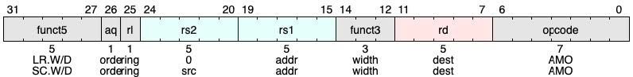
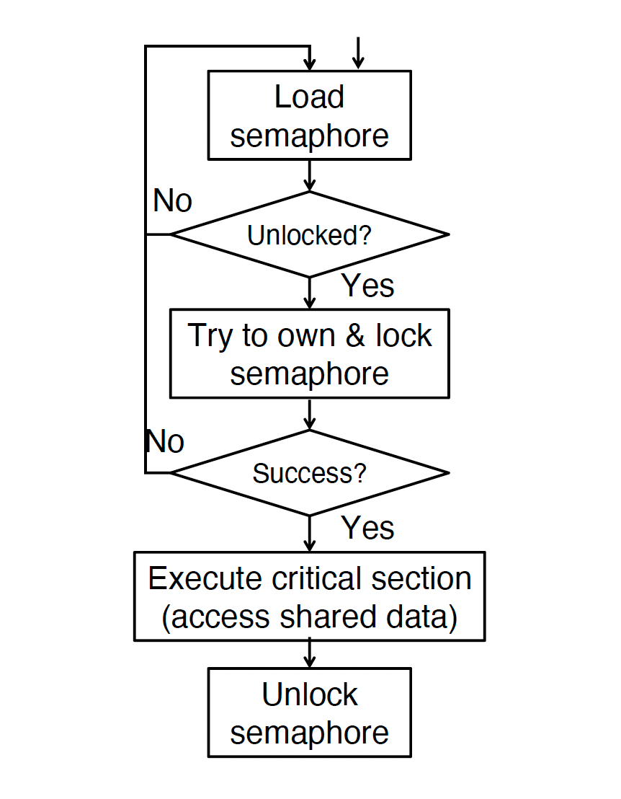

# Thread-Level Parallelism

#### Threads

- Threads (short for thread of execution) is a single stream of instructions.

- Each thread has:
	- Its own registers (including stack pointer)
	- Its own program counter (PC)
	- Shared memory (heap, global variables) with other threads

- Each processor provides one (or more) hardware threads (through multi-core or single-core multithreading, later) that actively execute instructions

- Within a given program’s process, threads can run concurrently.

- Operating system (OS) multiplexes multiple **software** threads onto the available hardware threads

#### Fork-Join Model

Fork-Join model: A program / process can split, or fork itself into separate threads, which can (in theory) execute concurrently.

- Main thread executes sequentially until first parallel task region.
- Fork: Main thread then creates a team of parallel subthreads.
- Join: When subthreads complete their parallel task region, they synchronize and terminate, leaving only the main thread.

## OpenMP

### OpenMP: Threads

```c
#include <omp.h>
```

```c
#pragma omp parallel
{
	// This code is executed by all threads
}
```

OpenMP creates as many threads as specified in the environment variable `OMP_NUM_THREADS`.

- Set this variable to max number of threads you want to use
- Generally, default: (# physical cores) * (# threads/core). Use `lscpu` command to obtain the numbers (e.g. 6 physical cores * 2 threads/core = **12 threads**)

OpenMP threads are OS (software) threads, which are then multiplexed onto available hardware threads.

| OpenMP Intrinsic                 | Description                   |
| -------------------------------- | ----------------------------- |
| `omp_set_num_threads(x)`         | Set number of threads to `x`. |
| `num_th = omp_get_num_threads()` | Get number of threads.        |
| `th_ID = omp_get_thread_num()`   | Get thread ID number.         |

### OpenMP: Shared/Private Variables

- Shared variables: All threads read/write the same variable.
	- Variable declared outside of parallel region
	- Heap-allocated variables
	- Static variables

- Private variables: Each thread has its own copy of the variable.
	- Variables declared inside parallel region (recall separate stack frames)

```c
int var1, var2;
char *var3 = malloc(...);
#pragma omp parallel private(var2)
{
	int var4;
	// var1 shared (default)
	// var2 private
	// var3 shared (heap)
	// var4 private (thread’s stack)
	...
}
```

## Data Race

- Two memory accesses form a data race if:
	- They are from different threads to the same location
	- At least one is a write, and
	- They occur one after another.

- Recall thread model: **shared memory**.
	- For a given thread, these two operations don't necessarily happen together...! Thread scheduling is *non-deterministic*.
		- Read current value of `x`
		- Write new value of `x`

!!! warning "Not a data hazard!"

	- Data hazard: Sequential instructions have data dependencies during concurrent execution (instruction-level parallelism via pipelining).

	- Here, even with no ILP, can have nondeterministic results. This results from lack of synchronization on which thread accesses memory first.

!!! example "Data Race Example"

	```c
	int x = 0;
	#pragma omp parallel
	{
		x = x + 1;
	}
	```

	`x` could be `0`~ # threads.

## OpenMP Synchronization

- To enforce multithreaded program correctness, we often need to **synchronize** threads, i.e., coordinate their execution.
	- Most commonly, know when one task is finished writing so that it is safe for another to read.

### Critical Sections with OpenMP

- A critical section is a segment of code that must be executed by a single thread at a time, thereby enforcing synchronization.

```c
#pragma omp barrier
```

- Forces all threads to wait until all threads have hit the barrier.

```c
#pragma omp critical
```

- Creates a critical section within a parallel code segment; only one thread can run a critical section at a time.

OpenMP has very restrictive parallelism.

- Really only good for parallelizing loops
	- If your critical section is too large, then effectively serial program → Amdahl's law quickly rears its ugly head
	- If critical sections not defined well, can run into **deadlock**.

## Lock Synchronization

- Use a “Lock” to grant access to a region (critical section) so that only one thread can have the lock and operate at a time
	- Need all processors to be able to access the lock, so use a location in shared memory as the **lock**

- Processors read lock and either wait (if locked) or set lock and go into critical section
	- `0` means lock is free / open / unlocked / lock off
	- `1` means lock is set / closed / locked / lock on

- Locks are one approach to implementing thread synchronization.

- Suppose lock in shared memory @ `0x5555 0000`

- Pseudocode:

```
Check lock @ 0x5555 0000
Set lock @ 0x5555 0000
Critical section (e.g. change shared variables)
Unset lock @ 0x5555 0000
```

- Two operations, formally:
	- Acquire: try to acquire the lock. If successful, keep going. Otherwise, wait and try later;
	- Release: Unlock and continue (only works if we originally had the lock)

## Lock Synchronization Realization

### Hardware Synchronization

- Hardware support required to prevent an interloper (another thread) from changing the value
	- **Atomic** read/write memory operation (all other operations must to happen strictly before/after the read/write)
	- No other access to the location allowed between the read and write

- How to implement in software?
	- Single instruction: atomic swap of register ↔ memory through atomic instructions;
	- Pair of instructions: one for read (and lock), one for write (and unlock);

- Needed even on uniprocessor systems
	- Interrupts can happen: can trigger thread context switches...

### RISC-V: Two solutions

- Option 1: Read/Write Pairs
	- Pair of instructions for “linked” read and write
	- Load-reserved and Store-conditional
	- No other access permitted between read and write
	- Must use shared memory (multiprocessing)
	
- Option 2: Atomic Memory Operations
	- Atomic swap of register ↔ memory

#### Option 1: Read/Write Pairs

- Load-reserved instruction: `lr rd, rs`
	- Load the word (doubleword) pointed to by `rs` into `rd`, and register a (hardware thread) reservation set :material-flag:

- Store-conditional: `sc rd, rs1, rs2`
	- Store the value in rs2 into the memory location pointed to by rs1, only if the reservation is still valid and set the status in `rd`
		- Returns 0 (success) to `rd` if location has not changed since the lr
		- Returns nonzero (failure) to `rd` if location has changed: Actual store will not take place
	- Invalid the (hardware thread) reservation whether success or not :material-flag-outline:



<div class="grid" markdown>

```c
    li t2, 1
Try:
	lr t1, s1
	bne t1, zero, Try
	sc t0, s1, t2
Locked:
	# critical section
Unlocked:
	sw zero, 0(s1)
```



</div>

#### Option 2: RISC-V Atomic Memory Operations (AMOs)

- Encoded with an R-type instruction format
	- `swap`, `add`, `and`, `or`, `xor`, `max`, `min`
	- `AMOSWAP rd, rs2, (rs1)`
	- `AMOADD rd, rs2, (rs1)`

- Take the value pointed to by `rs1`
	- Load it into `rd`
	- Apply the operation to that value with the contents in `rs2`
		- If `rs2` = `rd`, use the old value in `rd`
	- Store the result back to where `rs1` is pointed to

- This allows atomic swap as a primitive
	- It also allows "reduction operations" that are common to be efficiently implemented

```assmebly
	li t0, 1
Try:
	amoswap.w.aq t1, t0, 0(a0)
	bnez t1, Try
	# critical section
Unlocked:
	amoswap.w.rl zero, zero, 0(a0)
```

