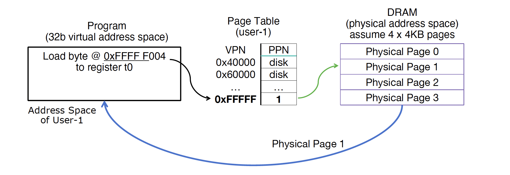
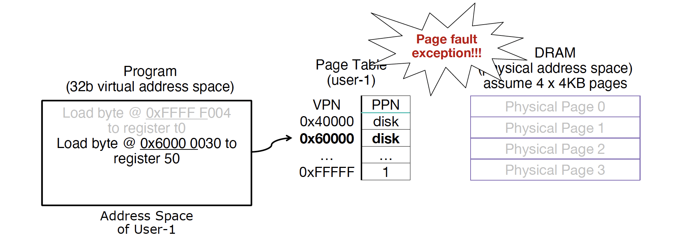
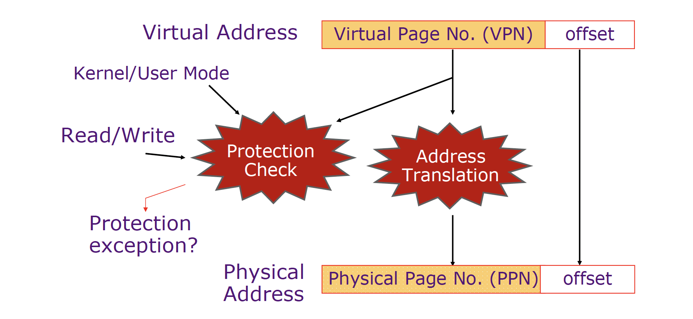
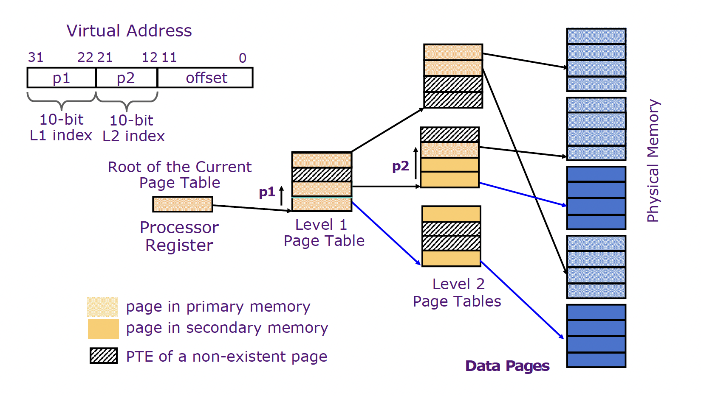

# Virtual Memory

## Intro. to Virtual Memory

### Motivation

- Adding disks to memory hierarchy
	- Need to devise a mechanism to “connect” memory and disk in the memory hierarchy

- Simplifying memory for applications
	- Applications should see the straightforward memory layout we saw earlier ->
	- User-space applications should think they own all of memory
	- So we give them a virtual view of memory

- Protection between processes
	- With a bare system, addresses issued with loads/stores are real physical addresses
	- This means any program can issue any address, therefore can access any part of memory, even areas which it doesn't own

- Memory fragmentation
	- As programs come and go, the storage is "fragmented".
	- Therefore, at some stage programs have to be moved around to compact the storage.

## Address Translation

We want to translate virtual addresses to physical addresses.

## Page Table

| VPN | PPN | Status | Dirty | Protection |
|--|--|--|--|--|
| 0xFFFF F004 | PPN/DPN | - | 0/1 | - |
| ... | ... | ... | ... | ... |

### Status Bits

On each memory access, first check if page table entry is “valid”.

- Valid/on → In main memory, read/write data as directed by process.

- Not Valid/off → On disk

	- Trigger page fault exception, OS intervenes to allocate the page into DRAM (trap handler);
	- If out of memory, select a page to replace in DRAM
	- Store outgoing page to disk, and page table entry that maps that VPN->PPN is marked as invalid/DPN
	- Read requested page from disk into DRAM and update with a valid PPN
	- Finally, read/write data as directed by process.

### Dirty Bit

When a page gets replaced:
- Dirty bit on: Write outgoing page back to disk.
- Dirty bit off: No disk write.

### Protection

### Multi-Level Page Tables

## TLB

| Address | Value |
|--|--|
| Virtual Address | $A_{\text{virt}}$ |
| Physical Address | $A_{\text{phys}}$ |
| Page Size | $P = 2^{o}$ |
| Associative | $A_{\text{assoc}}$ |

| Address | Width |
|--|--|
| VPN | $A_{\text{virt}} - o$ |
| PPN | $A_{\text{phys}} - o$ |
| Offset | $o$ |

| Parameters | Value |
| -- | -- |
| # Virtual Pages | $2^{A_{\text{virt}} - o}$ |
| # Physical Pages | $2^{A_{\text{phys}} - o}$ |
| # TLB Entries | $2^{A_{\text{virt}} - o} / A_{\text{assoc}}$ |
| # Page Table Entries | $2^{A_{\text{virt}} - o}$ |

