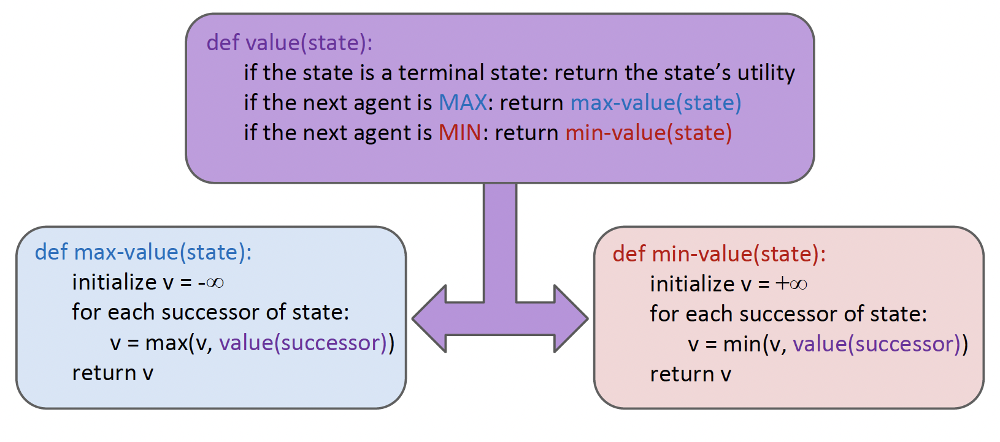
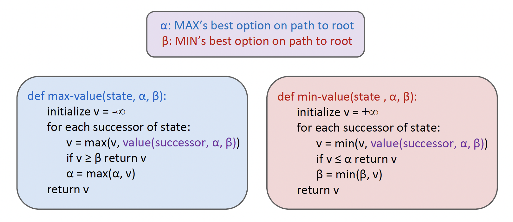
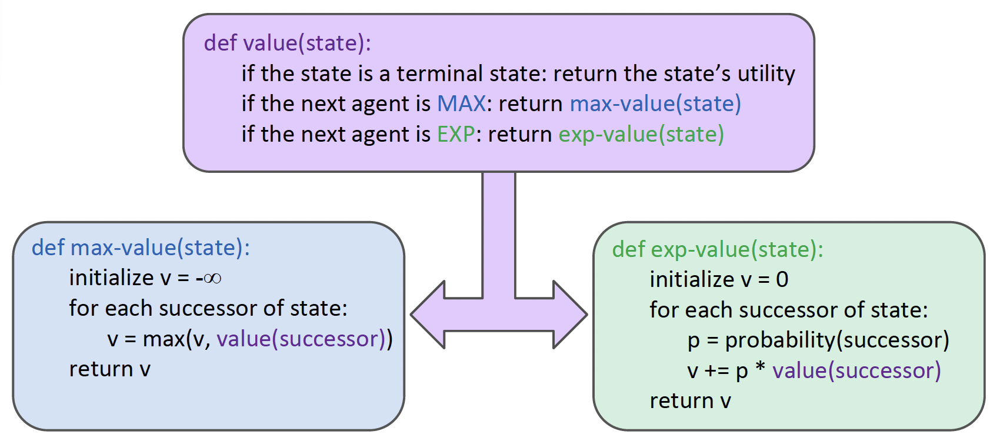

# Adversarial Search

#### Zero-Sum Games

- Agents have opposite utilities (values on outcomes).
- Let us think of a single value that one maximizes and the other minimizes.
- Adversarial, pure competition.

### Minimax

#### Minimax Values

> Policy: the agent should choose an action leading to the state with the largest value.

- State under agent's control: $V(s) = \max_{s' \in \text{successors}(s)} V(s')$.
- State under opponent's control: $V(s') = \min_{s' \in \text{successors}(s)} V(s)$.
- Terminal state: $V(s) = \text{known}$.

#### Adversarial Search

- A state-space search tree.
- Compute each node's minimax value: the best achievable utility against a rational (optimal) adversary.

!!! question "Problem: In realistic games, cannot search to leaves!"

	Solution: Depth-limited search.

#### Evaluation Functions

- Evaluation functions score non-terminals in depth-limited search.
- Ideal function: returns the actual minimax value of the position.
- A simple solution in practice: weighted linear sum of features:

$$
\text{Eval}(s) =  w_1 f_1(s) + w_2 f_2(s) + \cdots + w_n f_n(s)
$$

- Monte Carlo Tree Search.
- Convolutional Neural Network.

#### Alpha-Beta Pruning

General configuration (MIN version)

- We're computing the MIN-VALUE at some node $n$
- We're looping over $n$'s children, so $n$'s estimate is decreasing
- Let a be the best value that MAX can get at any choice point along the current path from the root
- If n becomes worse than $a$, then we can stop considering. ($n$'s other children)
- Reason: if $n$ is eventually chosen, then the nodes along the path shall all have the value of $n$, but n is worse than $a$ and hence the path shall not be chosen at the MAX.

MAX version is symmetric

### Expectimax Search

- Compute the average score under optimal play.

	- Max nodes as in minimax search.
	- Chance nodes are like min nodes but the outcome is uncertain.
	- Calculate their expected utilities, i.e. taking weighted average (expectation) of children.

