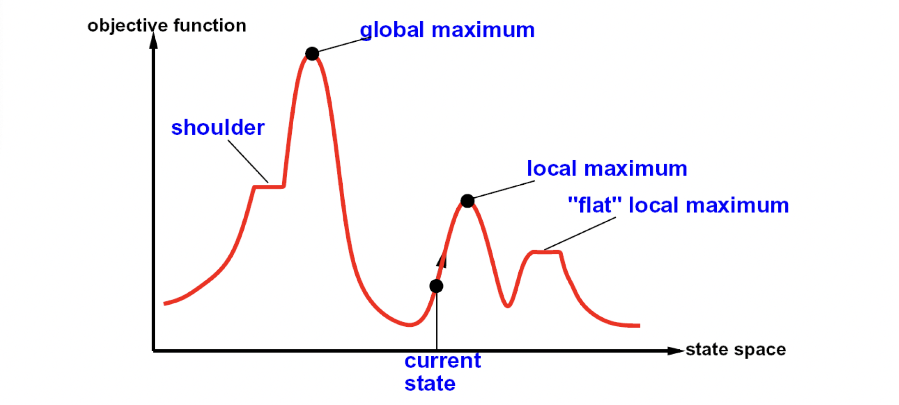

# Constraint Satisfaction Problem

### Search Problems

#### Standard Search Problem

- State is a "black box": arbitrary data structure
- Goal test can be any function over states
- Successor function can also be anything

#### Constraint Satisfaction Problems (CSPs)

- A special subset of search problems
- State is defined by variables $\mathbf{X}_i$ with values from a domain $\mathbf{D}$ (sometimes $\mathbf{D}$  depends on $i$)
- Goal test is a set of constraints specifying allowable combinations of values for subsets of variables

!!! question "Why we don't include all variables in explicit constraints?"

	In that case, the problem becomes standard search problem: consider all possible cases and run goal test.

#### Varieties of CSPs

#### Variesties of Constraints

### Solving CSP

#### Backtracking Search

- Backtracking search is the is the basic uninformed algorithm for solving CSPs.

- Idea 1: One variable at a time.

	- Variable assignments are commutative, so fix ordering.
	- i.e., [WA = red then NT = green] same as [NT = green then WA = red].
	- Only need to consider assignments to a single variable at each step.

- Idea 2: Check constraints as you go.
	
	- i.e. consider only values which do not conflict previous assignments.
	- Might have to do some computation to check the constraints.
	- "Incremental goal test".

- Depth-first search with these two improvements is called *backtracking search*.

### Improve Backtracking

#### Filtering: Forward Checking

- Filter: Keep track of domains for unassigned variables and cross offf bad options.
- Forward checking: Cross off values that violate a constraint when added to the existing assignment; whenever any variable has no value left, we backtrack.

#### Consistency of A Single Arc

- An arc $X\to Y$ is **consistent** iff for *every* $x$ in the tail there is *some* $y$ in the head which could be assigned without violating a constraint.

#### Ordering: Minimum Remaining Values

- Variable Ordering: Minimum remaining values (MRV):

	- Choose the variable with the fewest legal left values in its domain.

- Value Ordering: Least Constraining Value

	- Given a choice of variable, choose the *least constraining value*.
	- i.e. the one that rules out the fewest values in the remaining variables.

#### Tree-Structured CSPs

- Algorithm for tree-structured CSPs:
	- Order: Choose a root variable, order variables so that parents precede children.

!!! abstract "Theorem"

	If the constraint graph has no loops, the CSP can be solved in $O(n d^2)$ time.

#### Iterative Improvement

- Idea:
	- Take a complete assignment with unsatisfied constraints.
	- *Reassign* variable values to minimize conflicts.

- Algorithm: While not solved,
	- Variable selection: randomly select any conflicted variable
	- Value selection: min-conflicts heuristic:
		- Choose a value that violates the fewest constraints.

- Given random initial state, can solve n-queens in almost constant time for arbitrary
n with high probability (e.g., n = 10,000,000)!

- The same appears to be true for any randomly-generated CSP ***except*** in a narrow
range of the ratio

$$
R = \frac{\text{number of constraints}}{\text{number of variables}}
$$

#### Local Search

- Improve a single option until you can't make it better.

#### Beam Search

- Like greedy hill climbing search, but keep $K$ states at all times.

#### Simulated Annealing

- Idea: Escape local maxima by allowing downhill moves