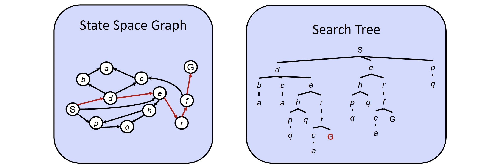
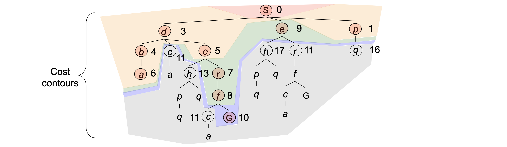

# Search

## Search Problem

### Reflex Agents vs. Planning Agents

- Reflex agents:

	- Choose action based on current percept. (and maybe memory)
		- Require a mapping from percepts to actions.

 	- Do not consider the future consequences of their actions.
	
	- **Consider how the world IS.**

- Planning agents:

	- Ask "what if".
	
	- Decisions based on (hypothesized) consequences of actions.
	
		- Must have a model of how the world evolves in response to actions.
		- Must formulate a goal.

	- **Consider how the world WOULD BE.**

### Search Problems

- A search problem consists of:

	- A state space
	- A successor function (with actions, costs)
	- A start state and a goal test

- A solution is a sequence of actions (a plan) which tranforms the start state to a goal state.

### Search Trees

- State space graph:

	- Nodes are world configurations.
	- Arcs represent successors (action results).
	- The goal test is a set of goal nodes.
	- Each state occurs only once.

- Search tree:
	
	- A "what if" tree of plans and their outcomes.
	- The start state is the root node.
	- Children correspond to successors.
	- For most problems, we can never actually build the whole tree.

### Search Algorithm

- Search:

	- Expand out potential plans (tree nodes).
	- Maintain a **fringe** of partial plans under consideration.
	- Try to expand as few tree nodes as possible.

- Complete: Guaranteed to find a solution if one exists?
- Optimal: Guaranteed to find the least cost path?
- Time & Space complexity?
- Number of nodes in entire tree?
	
	- $1 + b + b^2 + \cdots + b^m = O(b^m)$

#### Depth-First Search (DFS)

- Strategy: expand a deepest node first.
- Complete only if we prevent cycles.
- Not optimal.

#### Breadth-First Search (BFS)

- Strategy: expand a shallowest node first.
- Complete.
- Optimal only if costs are all 1.

#### Iterative Deepening

- Idea: get DFS's space advantage with BFS's time / shallow-solution advantages.

  	- Run a DFS with depth limit 1, 2, ...

#### Uniform Cost Search (UCS)

- Strategy: expand a cheapest node first.
- Complete.
- Optimal.

#### Greedy Search

- Strategy: expand a node that you think is closest to a goal state.
- Worst-case: like a badly-guided DFS.

#### A\* Search

- Combines UCS and Greedy.

	- Uniform-cost orders by path cost, or *backward cost* $g(n)$.
	- Greedy orders by goal proximity, or *forward cost* $h(n)$.

!!! tip "Admissibility"

	A heuristic $h$ is *admissible* (optimistic) if:

	$$
	0 \leq h(n) \leq h^*(n)
	$$

	where $h^*(n)$ is the true cost to a nearest goal.

!!! tip "Consistency"

	A heuristic \( h \) is *consistent* (or *monotonic*) if, for every node \( n \) and every successor \( n' \) of \( n \), the following condition holds:

	\[
	h(n) \leq c(n, n') + h(n')
	\]

	where \( c(n, n') \) is the cost of reaching \( n' \) from \( n \), and \( h(n) \) is the heuristic estimate of the cost from \( n \) to the goal.

### Search Heuristics

!!! quote "Heuristics"

	A heuristic $h$ is

	- A function that *estimates* how close a state is to a goal.

		- $h(\text{goal}) = 0$

	- Designed for a particular search problem.

	- Example: Manhattan distance, Euclidean distance for pathing.
