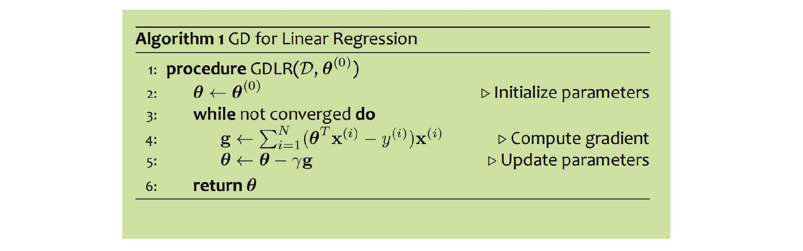

# Regression

## Linear Regression

### Introduction

- Goal:
	- Given a training dataset of pairs $(x, y)$, where $x$ is a vector, $y$ is a scalar.
	- Learn a function (aka. curve or line) $y' = h(x)$ that best fits the training data.

### Examples

#### $k$-Nearest Neighbors Regression

#### Decision Tree Regression

### Linear Functions, Residuals, and Mean Squared Error

Regression is predicting real-valued outputs

$$
D = \left\{\left(\mathbf{x}^{(i)}, y^{(i)}\right)\right\}_{i=1}^n \text{ with } \mathbf{x}^{(i)} \in \mathbb{R}^M, y^{(i)} \in \mathbb{R}
$$

!!! warning "Common Misunderstanding"

	Linear functions $\neq$ Linear decision boundaries.

### Optimization for ML

In unconstrained optimization, we try minimize (or maximize) a function with no constraints on the inputs to the function.

Given a function 
$$
J(\boldsymbol{\theta}), J: \mathbb{R}^M \rightarrow \mathbb{R}
$$

Our goal is to find
$$
\hat{\boldsymbol{\theta}} = \arg\min_{\boldsymbol{\theta} \in \mathbb{R}^M} J(\boldsymbol{\theta})
$$

!!! abstract "Linear Regression as Function Approximation"

	1. Assume $\mathcal{D}$ generated as:

		$$
		\mathbf{x}^{(i)} \sim p^*(\cdot) \\
		y^{(i)} = h^*(\mathbf{x}^{(i)})
		$$

	2. Choose hypothesis space, $\mathcal{H}$: all linear functions in $M$-dimensional space

		$$
		\mathcal{H} = \left\{ h_{\boldsymbol{\theta}}: h_{\boldsymbol{\theta}}(\mathbf{x}) = \boldsymbol{\theta}^{\top} \mathbf{x}, \boldsymbol{\theta} \in \mathbb{R}^M \right\}
		$$

	3. Choose an objective function: mean squared error (MSE)

		$$
		\begin{aligned}
			J(\boldsymbol{\theta}) &= \frac{1}{N} \sum_{i=1}^N e^{(i)} \\
			&= \frac{1}{N} \sum_{i=1}^N \left( y^{(i)} - h_{\boldsymbol{\theta}}(\mathbf{x}^{(i)}) \right)^2 \\
			&= \frac{1}{N} \sum_{i=1}^N \left( y^{(i)} - \boldsymbol{\theta}^{\top} \mathbf{x}^{(i)} \right)^2
		\end{aligned}
		$$

	4. Solve the unconstrained optimization problem via favorite method:

		- Gradient Descent
		- Closed form
		- etc.

	5. Test time: given a new $\mathbf{x}$, make prediction $\hat{y}$

		$$
		\hat{y} = h_{\hat{\boldsymbol{\theta}}}(\mathbf{x}) = \hat{\boldsymbol{\theta}}^{\top} \mathbf{x}
		$$

#### Optimization Method #0: Random Guess

!!! tip "Notation Trick: Folding in the Intercept Term"

	We can fold in the intercept term by adding a column of 1's to the input matrix $\mathbf{X}$.

	$$
	\mathbf{x'} = \begin{bmatrix} 1 & x_1 & x_2 & \cdots & x_M \end{bmatrix}^{\top} \\
	\boldsymbol{\theta} = \begin{bmatrix} b, w_1, \dots, w_M \end{bmatrix}^{\top}
	$$

	$$
	h_{\mathbf{w}, b}(\mathbf{x}) = \mathbf{w}^{\top} \mathbf{x} + b \\
	h_{\boldsymbol{\theta}}(\mathbf{x'}) = \boldsymbol{\theta}^{\top} \mathbf{x'}
	$$

!!! abstract "Random Guess"

	1. Pick a random $\boldsymbol{\theta}$
	2. Evaluate $J(\boldsymbol{\theta})$
	3. Repeat step 1 and 2 many times
	4. Return the $\boldsymbol{\theta}$ that gives the smallest $J(\boldsymbol{\theta})$

#### Optimization Method #1: Gradient Descent

!!! abstract "Gradient Descent"

	1. Choose an initial point $\vec{\boldsymbol{\theta}}$
	2. Repeat $t = 1, 2, \dots$

		a. Compute gradient $\vec{g} = \nabla \mathbf{J}(\vec{\boldsymbol{\theta}}) = \frac{1}{N} \sum_{i=1}^{N} \nabla \mathbf{J}^{(i)} (\boldsymbol{\theta})$

		b. Select step size $\delta_t \in R$

		c. Update parameters $\vec{\boldsymbol{\theta}} \leftarrow \vec{\boldsymbol{\theta}} - \delta_t \vec{g}$

	3. Return the best $\vec{\boldsymbol{\theta}}$ when some stopping criterion is reached.

### Support Vector Regression

$$
\text{minimize } \frac{1}{2} \|\mathbf{w}\|^2 + C \sum_t \left(|r^t - f(\mathbf{x}^t)| - \epsilon \right)_+
$$

where $C$ trades off the model complexity (i.e., the flatness of the model) and data misfit.

### Stochastic Gradient Descent

- Instead of computing the gradient over the entire dataset, we compute the gradient over a single example.

$$
g = \nabla \mathbf{J}^{(i)} (\boldsymbol{\theta})
$$

- Approximate true gradient by the gradient of one randomly chosen example.
- SGD reduces MSE much more rapidly than GD.

## Logistic Regression

### Capturing Uncertainty

$$
\sigma(z) = \frac{1}{1 + e^{-z}}
\quad g(x) = \sigma(w^{\top} \mathbf{x} + b) = \frac{1}{1 + e^{-w^{\top} \mathbf{x} + b}}
$$

### Linear Logistic Regression

- Idea: Predict $+1$ if probability $> 0.5$.

### Likelihood Function

=== "One R.V."

	Given $N$ independent, identically distributed (i.i.d.) samples $D ={x(1), x(2), \dots, x(N)}$ from a discrete random variable $X$ with probability mass function (pmf) $p(x\mid \theta) \dots$
	$$
	L(\theta) = p(y^{(1)}, y^{(2)}, \dots, y^{(N)} \mid \theta) = \prod_{i=1}^N p(y^{(i)} \mid \theta)
	$$

=== "Two R.V."

	Given $N$ i.i.d. samples $D = \{(x(1), y(1)), (x(2), y(2)), \dots, (x(N), y(N))\}$ from a pair of discrete random variable $X$ with pmf $p(x\mid \theta)$ and a discrete random variable $Y$ with pmf $p(y\mid x, \theta) \dots$
	$$
	L(\theta) = p(y^{(1)}, x^{(1)}, y^{(2)}, x^{(2)}, \dots, y^{(N)}, x^{(N)} \mid \theta) = \prod_{i=1}^N p(y^{(i)}, x^{(i)} \mid \theta)
	$$

### Logistic Regression

- **Data**: Inputs are continuous vectors of length M. Outputs are discrete.

$$
\mathcal{D} = \left\{\mathbf{x}^{(i)}, y^{(i)}\right\}^N_{i=1} \text{where } \mathbf{x} \in \mathbb{R}^M, y \in \{0, 1\}
$$

- **Model**: Logistic function applied to dot product of parameters with input vector.

$$
p_{\boldsymbol{\theta}}(y = 1 \mid \mathbf{x}) = \sigma(\boldsymbol{\theta}^{\top} \mathbf{x}) = \frac{1}{1 + e^{-\boldsymbol{\theta}^{\top} \mathbf{x}}}
$$

- **Learning**: Finds the parameters that minimize some objective function.

$$
\boldsymbol{\theta}^* = \arg\min_{\boldsymbol{\theta}} J(\boldsymbol{\theta})
$$

- **Prediction**: Output is the most probable class.

$$
\hat{y} = \argmax_{y \in \{0, 1\}} p_{\boldsymbol{\theta}}(y \mid \mathbf{x})
$$

### Mini-Batch SGD

- Approximate true gradient by the average gradient of $K$ randomly chosen examples.

$$
g = \frac{1}{S} \sum_{s=1}^S \nabla \mathbf{J}^{(i_s)} (\boldsymbol{\theta})
$$

## Bayes Optimal Classifier

- Definition: The classifier that minimizes the probability of misclassification.
- Bayes decision rule:

$$
\hat{y} = h(x) =
\begin{cases}
	1 & \text{if } p^*(y = 1 \mid x) \geq \alpha \\
	0 & \text{otherwise}
\end{cases}
$$

### Comparison Between Different Losses

|Aspect|0/1 Loss|Asymmetric Loss|Log-Loss (Cross-Entropy)|
|---|---|---|---|
|Purpose|Measures classification accuracy|Adjusts decision boundary penalties|Optimizes logistic regression|
|Mathematically Differentiable?|:x: No|:x: No|:white_check_mark: Yes|
|Used for?|Evaluation|Adjusting decision boundary|Optimization|
|Training Logistic Regression?|:x: No|:x: No|:white_check_mark: Yes|
|Alternative to Incorporate in Logistic Regression?|Adjust decision threshold $\alpha$|Use weighted log-loss|Directly used|