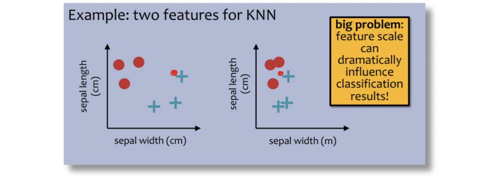

# Supervised Binary Classification

## Function Approximation

#### Notation

- Feature space, $\mathcal{X}$; Label space, $\mathcal{Y}$
- (*Unknown*) Target function, $c^*: \mathcal{X} \to \mathcal{Y}$
- Training dataset:

$$
\mathcal{D} = \left\{\left(\mathbf{x}^{(1)}, c^*\left(\mathbf{x}^{(1)}\right) = y^{(1)}\right), \left(\mathbf{x}^{(2)}, y^{(2)}\right), \dots, \left(\mathbf{x}^{(N)}, y^{(N)}\right)\right\}
$$

- Example: $\left(\mathbf{x}^{(n)}, y^{(n)}\right) = \left(x_1^{(n)}, x_2^{(n)}, \dots, x_D^{(n)}, y^{(n)}\right)$
- Hypothesis space: $\mathcal{H}$
- Goal: find a classifier, $h \in \mathcal{H}$, that best approximates $c^*$

#### Evaluation

- Loss function, $P: \mathcal{Y} \times \mathcal{Y} \to \mathbb{R}$

	- Defines how "bad" preditions, $\hat{y} = h(x)$, are compared to the true labels, $y = c^*(\mathbf{x})$
	- Common choices
		
		1. Squared loss (for regression): $\ell (y, \hat{y}) = (y-\hat{y})^2$
		2. Binary or 0-1 loss (for classification): $\ell(y,\hat{y}) = \mathbb{1} (y\neq \hat{y})$
	- Error rate:
$$
\text{err}(h, \mathcal{D}) = \frac{1}{N} \sum_{n=1}^N \mathcal{1}\left(y^{(n)}\neq \hat{y}^{(n)}\right) 
$$

!!! quote "Different Kinds of Error"

	- Training error rate = $\text{err}(h, \mathcal{D}_{\text{train}})$
	- Test error rate = $\text{err}(h, \mathcal{D}_{\text{test}})$
	- True error rate = $\text{err}(h)$ = the error rate of $h$ on all possible examples

### Decision Trees

#### Splitting Criterion

- A **splitting criterion** is a function that measures how good or useful splitting on a particular feature is *for a specified dataset*.
- Idea: when deciding which feature to split on, use the one that optimizesthe splitting criterion.
- Potential splitting criteria:
	- Training error rate (minimize)
 	- Gini impurity (minimize) → CART algorithm
	- Mutual information (maximize) → ID3 algorithm

#### Entropy

The entropy of a *random variable* is

$$
H(X) = - \sum_{v \in V(X)} P(X = v) \log_2 (P(X = v))
$$

where $X$ is a (discrete) random variable, $V(X)$ is the set of possible values $X$ can take on.

The entropy of a set is

$$
H(S) = - \sum_{v \in V(S)} \frac{|S_v|}{|S|} \log_2 \left(\frac{|S_v|}{|S|}\right)
$$

where $S$ is a collection of values, $V(S)$ is the set of unique values in $S$, $S_v$ is the collection of elements in $S$ with value $v$

#### Mutual Information

The mutual information between *two random variables* is

$$
I(Y;X) = H(Y) - H(Y \mid X) = H(Y) - \sum_{v \in V(X)} P(X = v) H(Y \mid X = v)
$$

The mutual information between a *feature and the label* is

$$
I(y;x_d) = H(y) - H(y \mid x_d) = H(y) - \sum_{v \in V(x_d)} f_v(H(Y_{x_d = v}))
$$

where $x_d$ is a feature and $y$ is the set of all labels, $V(x_d)$ is the set of possible values $x_d$ can take on, $f_v$ is the fraction of data points where $x_d = v$, $Y_{x_d = v}$ is the set of all labels where $x_d = v$.

#### Pseudocode

```python
def train(D):
	store root = tree_recurse(D)
def tree_recurse(D'):
	q = new node()
	base case - if (D' is empty or all labels in D' are the same or all features in D' are identical or some other stopping criterion):
		q.label = majority_vote(D')
	recursion - else:
		return q
```

#### Inductive Bias

- The inductive bias of a machine learning algorithm is the principle by which it generalizes to unseen examples

- What is the inductive bias of the ID3 algorithm?

	- Try to find the **smallest decision** tree that achieves a **low/zero training error** with **high mutual information** features at the top

- Occam's razor: try to find the "simplest" (e.g., smallest decision tree) classifier that explains the training dataset

#### Pros & Cons

- Pros
	- Interpretable
	- Efficient (computational cost and storage)
	- Can be used for classification and regression tasks
	- Compatible with categorical and real-valued features
- Cons
	- Learned greedily: each split only considers the immediate impact on the splitting criterion
	
		- Not guaranteed to find the smallest (fewest number of splits) tree that achieves a training error rate of 0.

#### Overfitting

1. Split data in two: training dataset and validation dataset.

2. Grow the full tree using the training dataset.

3. Repeatedly prune the tree:
	
	- Evaluate each split using a validation dataset by comparing the validation error rate **with and without** that split.
	- (Greedily) remove the split that most decreases the validation error rate.
	- Stop if no split improves validation error, otherwise repeat.

!!! warning "The Duck Test"

	If it looks like a duck, swims like a duck, and quacks like a duck, then it probably *is* a duck.

### $k$-Nearest Neighber (KNN)

```python
def train(D):
	Store D

def h(x'):
	Let x = the point in D that is nearest to x'
	return y
```

- Requires no training!
- Always has zero training error!
	- A data point is always its own nearest neighbor.

!!! question "How can we handle ties for even values of $k$?"

	- Consider another point.
	- Remove farthest of $k$ points.
	- Weight votes by distance.
	- Consider another distance metric.

!!! question "What is the inductive bias of KNN?"

	1. Similar points should have similar labels.
	2. All dimensions are created equally!

	

### Model Selection

=== "Statistics"

	- Def: a **model** defines the data generation process. (i.e. a set or family of parametric probability distributions)
	- Def: **model parameters** are the values that give rise to a particular probability distribution in the model family.
	- Def: **learning** (aka.estimation) is the process of finding the parameters that best fit the data.
	- Def: **hyperparameters** are the parameters of a prior distribution over parameters.
	
=== "Machine Learning"

	- Def: (loosely) a **model** defines the hypothesis space over which learning performs its search.
	- Def: **model parameters** are the numeric values or structure selected by the learning algorithm that give rise to a hypothesis.
	- Def: the **learning algorithm** defines the data-driven search over the hypothesis space. (i.e. search for good parameters)
	- Def: **hyperparameters** are the tunable aspects of the model, that the learning algorithm does not select.

### Cross-Validation

### The Perceptron Algorithm

- Key idea: Try to learn this hyperplane directly.
- Directly modeling the hyperplane would use a decision function:

$$
h(t) = \text{sign}(\boldsymbol{\theta}^{\top} t)
$$

#### Online Learning

- Batch Learning: We have access to the entire training dataset at once.
- Online Learning: A common alternative is the *online* setting, where examples arrive gradually and we learn continuously.

!!! abstract "(Online) Perceptron Algorithm"

	- Initialize the weight vector and intercept to all zeros:
	
	$$
	\mathbf{w} = \begin{bmatrix} 0 & 0 & \cdots & 0 \end{bmatrix} \text{ and } b = 0
	$$

	- For $t = 1,2,3,\dots$

		- Receive an unlabeled example, $x^{(t)}$
		- Predict its label, $\hat{y} = \text{sign} (\mathbf{w}^{\top} \mathbf{x} + b) = \begin{cases} +1, &\text{if }\mathbf{w}^{\top} \mathbf{x} + b \geq 0 \\ -1, &\text{otherwise}\end{cases}$
		- Observe its true label, $y^{(t)}$
		- If we misclassified an example $(y^{(t)} \neq \hat{y})$:
			- $\mathbf{w} \leftarrow \mathbf{w} + y^{(t)} \mathbf{x}^{(t)}$
			- $b \leftarrow b + y^{(t)}$

#### Perceptron Inductive Bias

1. Decision boundary should be linear
2. Recent mistakes are more important than older ones (and should be corrected immediately)

#### Perceptron Mistake Bound

- Def: For a **binary classification** problem, a set of examples $S$ is **linearly separable** if there exists a linear decision boundary that can separate the points.
- Def: The **margin** $\gamma$ for a dataset D is the greatest possible distance between a linear separator and the closest data point in $D$ to that linear separator