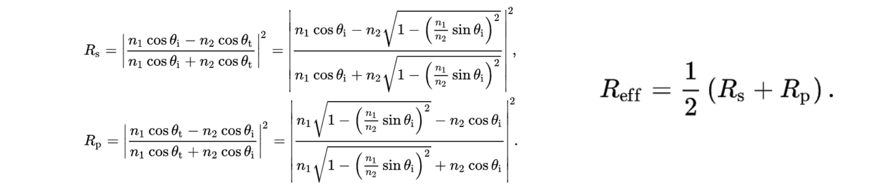

# Materials

### Materials == BRDF

| Kind                                   |      |
| -------------------------------------- | ---- |
| Diffuse / Lambertian Material          | BRDF |
| Glossy  Material                       | BRDF |
| Ideal Reflective / Refractive Material | BSDF |

#### Diffuse Reflection

Light is equally reflected in each ouput direction

#### Perfect Specular Reflection

$$
w_o = -w_i + 2(w_i\cdot \vec{n})\vec{n}
$$

#### Specular Reflection

In addition to reflecting off surface, light may be transmitted through surface.

Light refracts when it enters a new medium.

#### Snell's Law

$$
\eta_i \sin \theta_i = \eta_t \sin \theta_t
$$

#### Total Internal Reflection

When light is moving from a more optically dense medium to a less optically dense medium ($\cfrac{\eta_i}{\eta_t}>1$)

Light incident on boundary from large enough angle will not exit medium.

#### Fresnel Reflection / Term

Reflectance depends on incident angle (and polarization of light)

#### Formular

Accurate: need to consider polarization

Approximate: Schlick's approximation
$$
R(\theta) = R_0 + (1 - R_0)(1 - \cos \theta)^5\\

R_0 = \left(\frac{n_1 - n_2}{n_1 + n_2}\right)^2
$$

### Microfacet Material

#### Microfacet Theory

Rough surface

- Macroscale: flat & rough (**Texture**)
- Microscale: bumpy & specular (**Geometry**)

Individual elements of surface act like mirrors

- Known as Microfacets
- Each microfacet has its own normal

#### Microfacet BRDF

Key: the **distribution** of microfacets' normals

- Concentrated <==> Glossy
- Spread <==> Diffuse

$$
f(\mathbf{i}, \mathbf{o}) = \frac{\mathbf{F}(\mathbf{i}, \mathbf{h}) \mathbf{G}(\mathbf{i}, \mathbf{o}, \mathbf{h}) \mathbf{D}(\mathbf{h})}{4 (\mathbf{n}, \mathbf{i})(\mathbf{n}, \mathbf{o})}
$$

- $\mathbf{F}(\mathbf{i}, \mathbf{h})$ : Fresnel term
- $\mathbf{G}(\mathbf{i}, \mathbf{o}, \mathbf{h})$ : shadowing-masking term
- $\mathbf{D}(\mathbf{h})$ : distribution of normals

#### Isotropic / Anisotropic Materials (BRDFs)

Key: **directionality** of underlying surface

#### Anisotropic BRDFs

Reflection depends on azimuthal angle $\phi$
$$
f_r(\theta_i,\phi_i;\theta_r,\phi_r) \neq f_r(theta_i,\theta_r, \phi_r - \phi_i)
$$
Results from oriented microstructure of surface, e.g., brushed metal

#### Properties of BRDFs

- Non-negativity
  $$
  f_r(w_i\to w_r)\geq 0
  $$

- Linearity
  $$
  L_r(\mathbf{p}, \omega_r) = \int_{H^2} f_r(\mathbf{p}, \omega_i \rightarrow \omega_r) L_i(\mathbf{p}, \omega_i) \cos \theta_i \, d\omega_i
  $$

- Reciprocity principle (可逆性)
  $$
  f_r(w_i\to w_r) = f_r(w_r\to w_i)
  $$

- Energy conservation

$$
\forall \omega_r \int_{H^2} f_r(\omega_i \rightarrow \omega_r) \cos \theta_i \, d\omega_i \leq 1
$$

