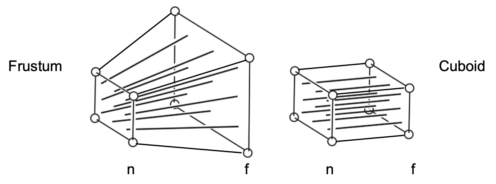

# Projection

## Orthographic Projection

$[l,r]\times[b,t]\times[f,n]$ to $[-1,1]^3$

$$
\mathbf{M}_{\text{ortho}} = \begin{pmatrix}
\frac{2}{r-l} & 0 & 0 & 0 \\
0 & \frac{2}{t-b} & 0 & 0 \\
0 & 0 & \frac{2}{n-f} & 0 \\
0 & 0 & 0 & 1
\end{pmatrix}
\begin{pmatrix}
1 & 0 & 0 & -\frac{r+l}{2} \\
0 & 1 & 0 & -\frac{t+b}{2} \\
0 & 0 & 1 & -\frac{n+f}{2} \\
0 & 0 & 0 & 1
\end{pmatrix}
$$

## Perspective Projection

$$
\mathbf{M}_{\text{persp}\to\text{ortho}} = \begin{pmatrix}
n & 0 & 0 & 0 \\
0 & n & 0 & 0 \\
0 & 0 & n+f & -nf \\
0 & 0 & 1 & 0
\end{pmatrix}
$$

$$
\mathbf{M}_{\text{persp}} = \mathbf{M}_{\text{ortho}}\mathbf{M}_{\text{persp}\to\text{ortho}}
$$

???+ question "Quiz"

	If we transform frustum into cuboid. For those points between $n$ and $f$, are they close to $n$ or $f$?

???+ quote "Solution"

	> This solution is from [BBS](https://games-cn.org/forums/topic/guanyulecture-04-kehousikaoti-xiangduigedaan/) @striveant

	First, $\mathbf{M}_{\text{persp}\to\text{ortho}}$ is given above. Let $A = \begin{pmatrix}0\\0\\z\\1\end{pmatrix}$, where $z = \dfrac{n+f}{2}$.

	Apply $\mathbf{M}_{\text{persp}\to\text{ortho}}$ on $A$:

	$$
	\mathbf{M}_{\text{persp}\to\text{ortho}} A = 
	\begin{pmatrix}
	0\\0\\\frac{n+f}{2}(n+f)-nf\\\frac{n+f}{2}
	\end{pmatrix} = 
	\begin{pmatrix}
	0\\0\\\frac{n^2+f^2}{n+f}\\1
	\end{pmatrix}
	\stackrel{\text{def}}{=}
	\begin{pmatrix}0\\0\\z'\\1\end{pmatrix}
	$$

	Since $f<z<n<0$,

	$$
	z-z' = \frac{n+f}{2} - \frac{n^2+f^2}{n+f} = -\frac{(n-f)^2}{2(n+f)} > 0
	$$

	This means the point is closer to $f$.

	More general,

	$$
	\mathbf{M}_{\text{persp}\to\text{ortho}} A =
	\begin{pmatrix}
	0\\0\\z(n+f)-nf\\z
	\end{pmatrix}=
	\begin{pmatrix}
	0\\0\\n+f-\frac{nf}{z}\\1
	\end{pmatrix}
	\stackrel{\text{def}}{=}
	\begin{pmatrix}0\\0\\z'\\1\end{pmatrix}
	$$

	$$
	\begin{aligned}
	z-z' &= z - (n+f-\frac{nf}{z})\\
	&= (z-n) - f(1-\frac{n}{z})\\
	&= \frac{1}{z}(z-n)(z-f) > 0
	\end{aligned}
	$$

	This means the point is closer to $f$.