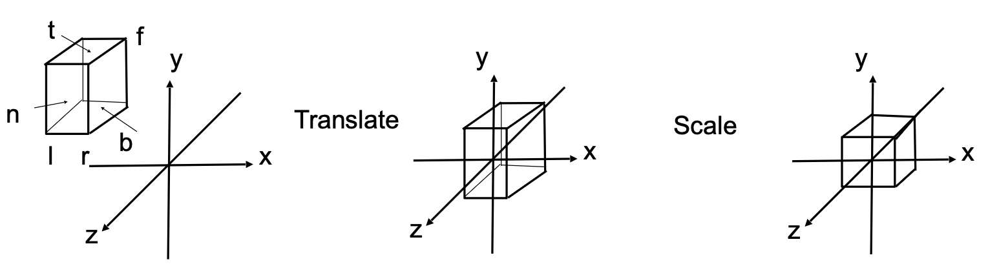
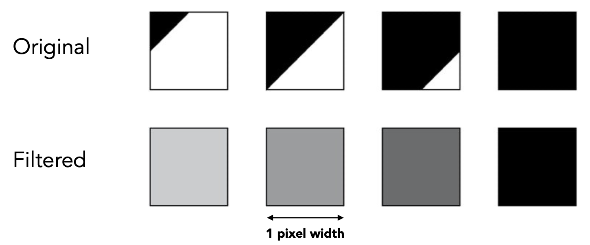
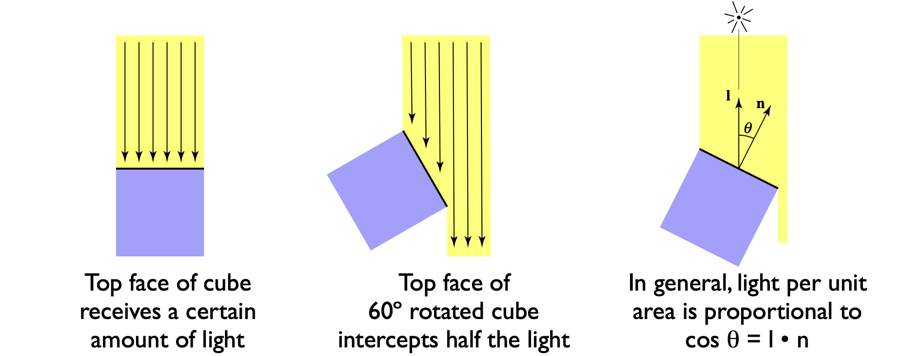
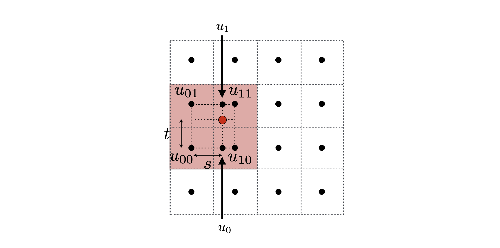
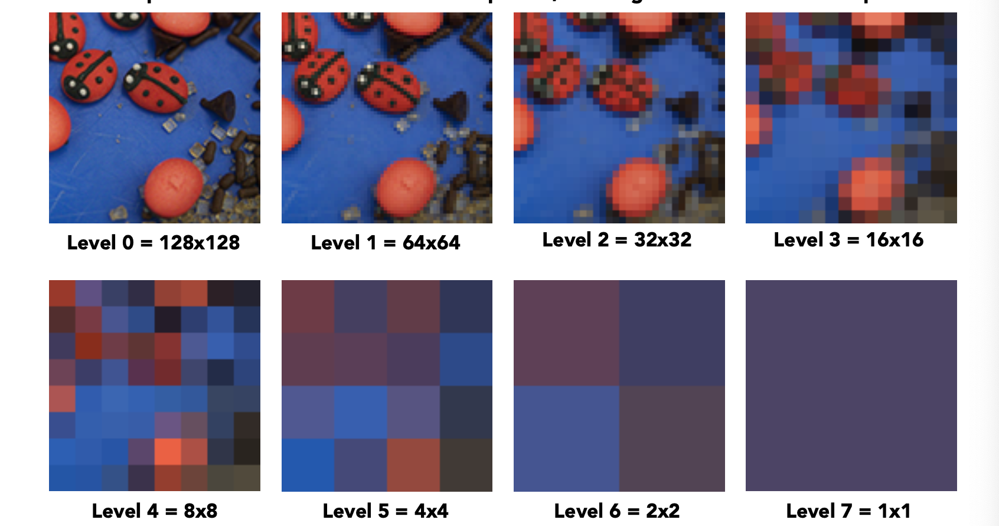

# Rasterization

## Projection

### Orthographic Projection

$[l,r]\times[b,t]\times[f,n]$ to $[-1,1]^3$

$$
\mathbf{M}_{\text{ortho}} = \begin{pmatrix}
\frac{2}{r-l} & 0 & 0 & 0 \\
0 & \frac{2}{t-b} & 0 & 0 \\
0 & 0 & \frac{2}{n-f} & 0 \\
0 & 0 & 0 & 1
\end{pmatrix}
\begin{pmatrix}
1 & 0 & 0 & -\frac{r+l}{2} \\
0 & 1 & 0 & -\frac{t+b}{2} \\
0 & 0 & 1 & -\frac{n+f}{2} \\
0 & 0 & 0 & 1
\end{pmatrix}
$$



### Perspective Projection

$$
\mathbf{M}_{\text{persp}\to\text{ortho}} = \begin{pmatrix}
n & 0 & 0 & 0 \\
0 & n & 0 & 0 \\
0 & 0 & n+f & -nf \\
0 & 0 & 1 & 0
\end{pmatrix}
$$

$$
\mathbf{M}_{\text{persp}} = \mathbf{M}_{\text{ortho}}\mathbf{M}_{\text{persp}\to\text{ortho}}
$$

## Viewing

### Perspective Projection

$$
\tan{\dfrac{\text{fovY}}{2}=\dfrac{t}{|n|}}
$$

$$
\text{aspect} = \dfrac{r}{t}
$$

### Canonical Cube to Screen

$[-1,1]^2\to [0, \text{width}]\times [0, \text{height}]$

$$
\mathbf{M}_{\text{viewport}} = 
\begin{pmatrix}
\dfrac{\text{width}}{2} & 0 & 0 & \dfrac{\text{width}}{2}\\
0 & \dfrac{\text{height}}{2} & 0 & \dfrac{\text{height}}{2}\\
0 & 0 & 1 & 0\\
0 & 0 & 0 & 1
\end{pmatrix}
$$

???+ question "Quiz"

	If we transform frustum into cuboid. For those points between $n$ and $f$, are they close to $n$ or $f$?

???- quote "Solution"

	> This solution is from [BBS](https://games-cn.org/forums/topic/guanyulecture-04-kehousikaoti-xiangduigedaan/) @striveant

	First, $\mathbf{M}_{\text{persp}\to\text{ortho}}$ is given above. Let $A = \begin{pmatrix}0\\0\\z\\1\end{pmatrix}$, where $z = \dfrac{n+f}{2}$.

	Apply $\mathbf{M}_{\text{persp}\to\text{ortho}}$ on $A$:

	$$
	\mathbf{M}_{\text{persp}\to\text{ortho}} A = 
	\begin{pmatrix}
	0\\0\\\frac{n+f}{2}(n+f)-nf\\\frac{n+f}{2}
	\end{pmatrix} = 
	\begin{pmatrix}
	0\\0\\\frac{n^2+f^2}{n+f}\\1
	\end{pmatrix}
	\stackrel{\text{def}}{=}
	\begin{pmatrix}0\\0\\z'\\1\end{pmatrix}
	$$

	Since $f<z<n<0$,

	$$
	z-z' = \frac{n+f}{2} - \frac{n^2+f^2}{n+f} = -\frac{(n-f)^2}{2(n+f)} > 0
	$$

	This means the point is closer to $f$.

	More general,

	$$
	\mathbf{M}_{\text{persp}\to\text{ortho}} A =
	\begin{pmatrix}
	0\\0\\z(n+f)-nf\\z
	\end{pmatrix}=
	\begin{pmatrix}
	0\\0\\n+f-\frac{nf}{z}\\1
	\end{pmatrix}
	\stackrel{\text{def}}{=}
	\begin{pmatrix}0\\0\\z'\\1\end{pmatrix}
	$$

	$$
	\begin{aligned}
	z-z' &= z - (n+f-\frac{nf}{z})\\
	&= (z-n) - f(1-\frac{n}{z})\\
	&= \frac{1}{z}(z-n)(z-f) > 0
	\end{aligned}
	$$

	This means the point is closer to $f$.

## Antialiasing

### Before Antialiasing

#### Sampling Artifacts

Jaggies, Moire, Wagon wheel effect...

#### Idea: Blurring Before Sampling

> Sample then filter, WRONG!

### Frequency Domain

#### Fourier Series & Transform

- Higher Frequencies Need Faster Sampling

- Undersampling Creates Frequency Aliases

Filtering = Getting rid of certain frequency contents

#### Filtering = Convolution

Convolution in the spatial domain = Multiplication in the frequency domain

##### Option 1

- Filter by convolution in the spatial domain

##### Option 2

- Transform to frequency domain (Fourier transform)
- Multiply by Fourier transform of convolution kernel
- Transform back to spatial domain (inverse Fourier)

#### Sampling = Repeating Frequency Contents

Sparse sampling will cause aliasing

How can we reduce aliasing error?

##### Option 1: Increase samling rate

- Essentially increasing the distance between replicas in the Fourier domain
- Higher resolution displays, sensors, framebuffers...
- BUT: costly & may need very high resolution

##### Option 2: Antialiasing

- Making Fourier contents "narrower" before repeating
- i.e. **Filtering out high frequencies before sampling**

###  Antialiasing

A 1 pixel-width box filter (low pass, blurring)

#### Antialiasing By Averaging Values in Pixel Area

##### Solution:

- **Convolve**: $f(x,y)$ by 1-pixel box-blur
- **Then sample** at every pixel's center

#### Antialiasing by Computing Average Pixel Value

In rasterizing one triangle, the average value inside a pixel area of $f(x,y) = inside(triangle,x,y)$ is equal to the area of the pixel covered by the triangle.



### Antialiasing By Supersampling (MSAA)

MSAA = Muti-Sample-Anti-Aliasing

#### Supersampling

Sampling multiple locations within a pixel

##### Step 1

- Take $N\times N$ samples in each pixel

##### Step 2

- Average the $N\times N$ samples "inside" each pixel

##### Step 3 Result

### Antialiasing Today

No free lunch!

- Cost of MSAA

Milestones

- FXAA (Fast Approximate AA)
- TAA (Temporal AA)

Super resolution / super sampling

- From low res to high res
- Essentially still "not enough samples" problem
- DLSS (Deep Learning Super Sampling)

## Visibility / Occlusion

#### Painter's Algorithm

Requires sorting in depth, can have unresolvable depth order

### Z-Buffer (深度缓存)

#### Idea

- Store current min. z-value **for <u>each</u> sample (pixel)**

- Needs an additional buffer for depth values
  - frame buffer stores color values
  - depth buffer (z-buffer) stores depth

> [!IMPORTANT]
>
> For simplicity we suppose **z is always positive**

#### Step

- Initialize depth buffer to $\infty$
- During rasterization:

```c
for (each triangles T)
  for (eachsample(x, y, z) in T)
    if (z < zbuffer[x, y])           // closest sample so far
      framebuffer[x, y] = rgb;       // update color
      zbuffer[x, y] = z;             // update depth
    else
    	;                   // do nothing, this sample is occluded
```

#### Complexity

- $O(n)$ for $n$ triangles (assuming constant coverage)

> Most important visibility algorithm, Implemented in hardware for all GPUs

## Shading

Definition in this course: The process of applying a material to an object.

### Blinn-Phong Reflectance Model


$$
L = L_a + L_d + L_s
$$

Compute light reflected toward camera

**No shadows** will be generated! (shading $\neq$ shadow)

#### Diffuse Reflection

Lambert's Cosine Law:



Shading **independent** of view direction

$$
L_d = k_d(I/r^2)\max(0, \mathbf{n}\cdot\mathbf{l})
$$

#### Specular Term

Intensity **depends** on view direction

- Bright near mirror reflection direction

- $\mathbf{v}$ close to mirror direction $\Leftrightarrow$ **half vector** near normal

$$
\mathbf{h} = \text{bisector}(\mathbf{v},\mathbf{l}) = \frac{\mathbf{v} + \mathbf{l}}{\|\mathbf{v}+\mathbf{l}\|}
$$

$$
\begin{aligned}
L_s &= k_s(I/r^2)\max(0, \cos\alpha)^p\\
&= k_s(I/r^2)\max(0, \mathbf{n} \cdot \mathbf{h})^p
\end{aligned}
$$

#### Ambient Term

Shading that does not depend on anything

- Add constant color to account for disregarded illumination and fill in black shadows

- This is approximate / fake!

$$
L_a = k_aI_a
$$

### Shading Frequencies

Shade each triangle (flat shading)

Shade each vertex (Gourand shading)

Shade each pixel (Phong shading)

## Texture

### Texture Mapping

#### Surfaces are 2D

Screen space $(x_s,y_s)$ $\to$ World space $(x,y,z)$ $\to$ Texture space $(u,v)$

### Interpolation Across Triangles: Barycentric Coordinates

#### Barycentric Coordinates

A coordinate system for triangles $(\alpha,\beta,\gamma)$

$$
(x,y) = \alpha A+\beta B+\gamma C\\
\alpha + \beta + \gamma = 1
$$

is **inside the triangle if all three coordinates are non-negative**

#### Geometric Viewpoint: Proportional Areas

$$
\begin{aligned}
\alpha = \frac{A_A}{A_A + A_B + A_C}\\
\beta = \frac{A_B}{A_A + A_B + A_C}\\
\gamma = \frac{A_C}{A_A + A_B + A_C}
\end{aligned}
$$

#### Formulas

$$
\begin{aligned}
\alpha &= \frac{-(x - x_B)(y_C - y_B) + (y - y_B)(x_C - x_B)}{-(x_A - x_B)(y_C - y_B) + (y_A - y_B)(x_C - x_B)}\\
\beta &= \frac{-(x - x_C)(y_A - y_C) + (y - y_C)(x_A - x_C)}{-(x_B - x_C)(y_A - y_C) + (y_B - y_C)(x_A - x_C)}\\
\gamma &= 1 - \alpha - \beta
\end{aligned}
$$

### Applying Textures

#### Simple Texture Mapping: Diffuse Color

```
for each rasterized screen sample (x,y):
  (u,v) = evaluate texture coordinate at (x,y);
  texcolor = texture.sample(u,v);
  set sample's color to texcolor;
```

### Texture Magnification

(What if the texture is too small?)

#### Bilinear Interpolation



1. Take 4 nearest sample locations, with texture values as labeled

2. And fractional offsets $(s,t)$ as shown

3. Linear interpolation (1D)

    $\text{lerp}(x,v_0,v_1) = v_0 + x(v_1 - v_0)$

4. Two helper lerps

    $u_0 = \text{lerp}(s, u_{00}, u_{10})$

    $u_1 = \text{lerp}(s, u_{01}, u_{11})$

5. Final vertical lerp, to get result:

    $f(x,y) = \text{lerp}(t, u_0, u_1)$

Bilinear interpolation usually gives pretty good results at reasonable costs

(What if the texture is too large?)

### Mipmap



Level = $D$

#### Computing Mipmap Level $D$


$$
D = \log_2L
$$

$$
L = \max\left(\sqrt{\left(\frac{\text{d}u}{\text{d}x}\right)^2 + \left(\frac{\text{d}v}{\text{d}x}\right)^2},\sqrt{\left(\frac{\text{d}u}{\text{d}y}\right)^2 + \left(\frac{\text{d}v}{\text{d}y}\right)^2}\right)
$$

#### Trilinear Interpolation

Bilinear result in Mipmap Level $D$ + Bilinear result in Mipmap Level $D+1$

### Applications of Texture

#### Bump Mapping

Adding surface normal per pixel (for shading computations only)

- Original surface normal $n(p) = (0, 0, 1)$

- Derivative at $p$ are

	- $\text{d}p/\text{d}u = c_1 * [h(u+1)-h(u)]$

	- $\text{d}p/\text{d}v = c_2 * [h(v+1)-h(v)]$

- Perturbed normal is then $n(p) = (-\text{d}p/\text{d}u,\text{d}p/\text{d}v, 1).\text{normalized}()$

#### Displacement Mapping

A more advanced approach

- Uses the same texture in bumping mapping

- Actually **moves the vertices**

## Graphics (Real-Time Rendering) Pipline

### Graphics Pipline

- **Vertex Processing**: Model, View, Projection transforms

- **Triangle Processing**

- **Rasterization**: Sampling triangle coverage

- **Fragment Processing**: Z-Buffer Visibility Tests, Shading, Texture mapping

- **Framebuffer Operations**
