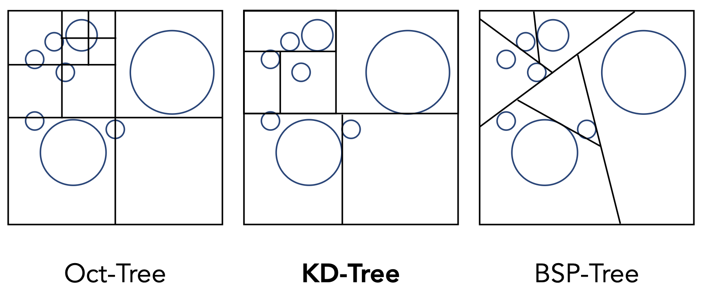
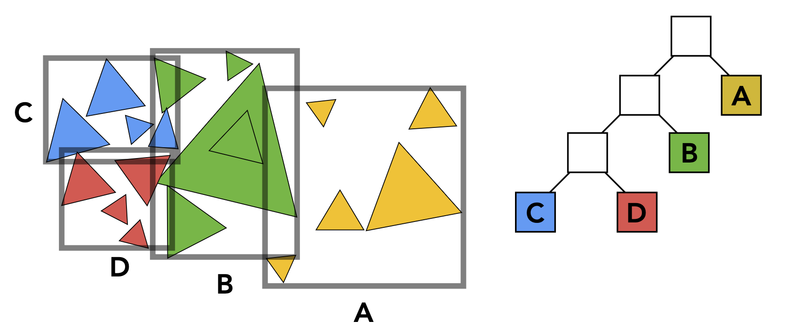
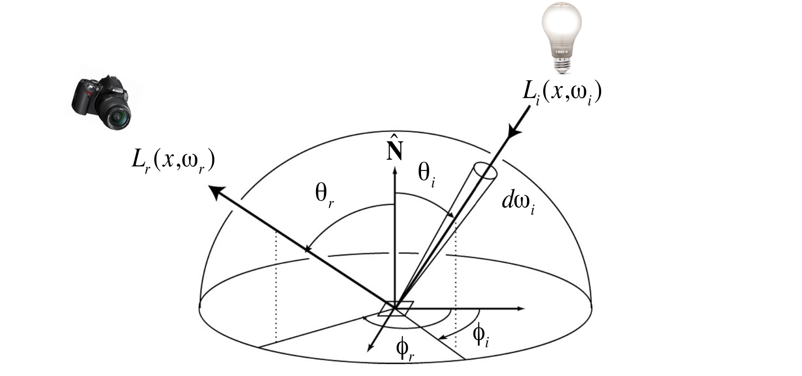

# Ray Tracing

## Whitted-Style Ray Tracing

### Why Ray Tracing?

- Rasterization couldn't handle **global** effects well
- Rasterization is fast, but quality is relatively low
- Ray tracing is accurate, but is **very slow**

### Basic Ray-Tracing Algorithm


### Ray-Surface Intersection

#### Ray Equation

$$
\mathbf{r} = \mathbf{o} + t\mathbf{d}\quad 0\leq t < \infty
$$

- $\mathbf{r}$ : point along ray
- t : "time"
- $\mathbf{o}$ : origin
- $\mathbf{d}$ : (normalized) direction

#### Plane Equation

$$
\mathbf{p}: (\mathbf{p} - \mathbf{p}')\cdot \mathbf{N}=0
$$

- $\mathbf{p}$ : all points on plane
- $\mathbf{p}'$ : one point on plane
- $\mathbf{N}$ : normal vector

#### Ray Intersection With Plane

$$
\mathbf{p}=\mathbf{r}(t)\\
t = \frac{(\mathbf{p}'-\mathbf{o})\cdot \mathbf{N}}{\mathbf{d}\cdot\mathbf{N}}
$$

Check: $0\leq t < \infty$

#### Möller–Trumbore Algorithm

A faster approach, giving barycentric coordinate directly
$$
\mathbf{O} + t\mathbf{D} = (1-b_1-b_2)\mathbf{P}_0 + b_1\mathbf{P}_1 + b_2\mathbf{P}_2
$$

$$
\begin{bmatrix}
t\\b_1\\b_2
\end{bmatrix} 
= \frac{1}{\mathbf{S}_1\cdot\mathbf{E}_1}
\begin{bmatrix}
\mathbf{S}_2\cdot \mathbf{E}_2\\
\mathbf{S}_1\cdot \mathbf{S}\\
\mathbf{S}_2\cdot \mathbf{D}
\end{bmatrix}
$$

where

- $\mathbf{E}_1 = \mathbf{P}_1 - \mathbf{P}_0$ , $\mathbf{E}_2 = \mathbf{P}_2 - \mathbf{P}_0$​
- $\mathbf{S} = \mathbf{O} - \mathbf{P}_0$
- $\mathbf{S}_1 = \mathbf{D}\times \mathbf{E}_2$ , $\mathbf{S}_2 = \mathbf{S}\times \mathbf{E}_1$

Cost = (1 div, 27 mul, 17 add)

### Bounding Volumes

#### Axis-Aligned Bounding Box(AABB)


$t_{\text{enter}}=\max\{t_{\text{min}}\}$, $t_{\text{exit}}=\min\{t_{\text{max}}\}$
$$
t=\frac{\mathbf{p}_x' - \mathbf{o}_x}{\mathbf{d}_x}
$$

### Using AABBs to accelerate ray tracing

#### Preprocess - Build Acceleration Grid

1. Find bounding box
2. Create grid
3. Store each object in overlapping cells

Step through grid in ray traversal order

For each grid cell, test intersection with all objects stored at that cell

#### Grid Resolution

Heuristic:

- \#cells = C * \#objs
- $C\approx 27$ in 3D

### Spatial Partitions



#### KD-Tree Pre-Processing


Internal nodes store

- split axis: x-, y-, or z-axis
- split position: coordinate of split plane along axis
- children: pointers to child nodes
- **No objects are stored in internal nodes**

Leaf nodes store

- list of objects

### Object Partitions & Bounding Volume Hierarchy (BVH)

#### Building BVH

- Find bounding box
- Recursively split set of objects in two subsets
- **Recompute** the bounding box of the subsets
- Stop when necessary
- Store objects in each leaf node



Internal nodes store

- Bounding box

- Children: pointers to child nodes 

Leaf nodes store

- Bounding box

- List of objects

Nodes represent subset of primitives in scene

- All objects in subtree

#### BVH Traversal

```cpp
Intersect(Ray ray, BVH node) {
  if (ray misses node.bbox) return;
  
  if (node is a leaf node) {
    test intersection with all objs;
    return closest iontersection;
  }
  
  hit1 = Intersect(ray, node.child1);
  hit2 = Intersect(ray, node.child2);
  
  return the closest of hit1, hit2;
}
```

#### Spatial vs Object Partitions

Spatial partition (e.g. KD-tree)

- Partition space into non-overlapping regions
- An object can be contained in multiple regions

Object partition (e.g. BVH)

- Partition set of objects into disjoint subsets
- Bounding boxes for each set may overlap in space

### Basic Radiometry

Measurement system and units for illumination

Accurately measure the spatial properties of light

- Radiant flux, intensity, irradiance, radiance

Perform lighting calculations **in a physically correct manner**

####  Radiant Energy and Flux (Power)

$$
Q\ [\text{J}=\text{Joule}]
$$

$$
\Phi \equiv \frac{\text{d}Q}{\text{d}t}\ [\text{W}=\text{Watt}]\ [\text{lm}=\text{lumen}]
$$

#### Flux - #photons flowing through a sensor in unit time


#### Solid Angle

Definition: Ratio of subtended area on sphere to radius squared.
$$
\Omega = \frac{A}{r^2}
$$

$$
\text{d}A = (r\text{d}\theta)(r\sin\text{d}\phi) = r^2\sin\theta\text{d}\theta\text{d}\phi\\
\text{d}\omega = \frac{\text{d}A}{r^2} = \sin\theta \text{d}\theta\text{d}\phi
$$

#### Radiant Intensity

Definition: The radiant (luminous) intensity is the **power per unit solid angle** emitted by a point light source.
$$
I(\omega)\equiv \frac{\text{d}\Phi}{\text{d}\omega}\\
\left[ \frac{\text{W}}{\text{sr}} \right] \left[ \frac{\text{lm}}{\text{sr}} = \text{cd} = \text{candela} \right]
$$

#### Irradiance

Definition: The irradiance is the **power per projected unit area** incident on a surface point.
$$
E(\mathbf{x}) \equiv \frac{\text{d}\Phi(\mathbf{x})}{\text{d}A}\\\
\left[ \frac{\text{W}}{\text{m}^2} \right] \left[ \frac{\text{lm}}{\text{m}^2} = \text{lux}\right]
$$

#### Lambert's Cosine Law


#### Radiance

Definition: The radiance (luminance) is the  **power per unit solid angle** *per projected unit area*.
$$
L(\text{p},\omega) \equiv \frac{\text{d}^2\Phi(\text{p},\omega)}{\text{d}\omega\text{d}A\cos\theta}
$$
Recall

- Irradiance: power per projected unit area
- Intensity: power per solid angle

So

- Radiance: Irradiance per solid angle
- Radiance: Intensity per projected unit area

#### Irradiance vs. Radiance

Irradiance: total power received by area $\text{d}A$

Radiance: power received by area $\text{d}A$ from "direction" $\text{d}\omega$

### Bidirectional Reflectance Distribution Function(BRDF)

#### BRDF

The BRDF represents how much light is reflected into each outgoing direction $\omega_r$ from each incoming direction
$$
f_r(\omega_i\to \omega_r) = \frac{\text{d}L_r(\omega_r)}{\text{d}E_i(\omega_i)} = \frac{\text{d}L_r(\omega_r)}{L_i(\omega_i)\cos\theta_i\text{d}\omega_i}
\begin{bmatrix}
1\newline
\text{sr}
\end{bmatrix}
$$

#### The Reflection Equation


$$
L_r(\text{p},\omega_r) = \int_{H^2} f_r(\text{p},\omega_i\to\omega_r)L_i(\text{p},\omega_i)\cos\theta_i\text{d}\omega_i
$$
Adding an Emission term to make it general:
$$
L_o(\text{p},\omega_o) = L_e(\text{p},\omega_o) + \int_{\Omega^+}L_i(\text{p},\omega_i) f_r(\text{p},\omega_i, \omega_o)(n\cdot \omega_i)\text{d}\omega_i
$$
Note: now, we assume that all directions are pointing **outwards**!

### Understanding the Rendering Equation

#### Linear Operator Equation

$$
l(u) = e(u) + \int l(v)\underbrace{K(u,v)\text{d}v}_{\text{Kernel of equation}}\\
L=E+KL
$$

$$
L=E+KE+K^2E+K^3E+\cdots
$$

## Path Tracing

#### Problem

- Where should the ray be reflected for **glossy** materials?

- No reflections between diffuse materials?

#### A Simple Monte Carlo Solution

Compute the radiance at $p$ towards the camera

$$
L_o(\text{p},\omega_o) = \int_{\Omega^+}L_i(\text{p},\omega_i) f_r(\text{p},\omega_i, \omega_o)(n\cdot \omega_i)\text{d}\omega_i
$$

Monte Carlo Integration: $\displaystyle \int f(x)\text{d}x = \frac{1}{N} \sum_{i=1}^N\frac{f(X_i)}{p(X_i)}\quad X_i\sim p(x)$

"$f(x)$": $L_i(\text{p},\omega_i) f_r(\text{p},\omega_i, \omega_o)(n\cdot \omega_i)$

PDF: $p(\omega_i)=1/2\pi$ (assume uniformly sampling the hemisphere)

$$
\begin{aligned}
L_o(\text{p},\omega_o) &= \int_{\Omega^+}L_i(\text{p},\omega_i) f_r(\text{p},\omega_i, \omega_o)(n\cdot \omega_i)\text{d}\omega_i\\
&\approx \frac{1}{N}\sum_{i=1}^N\frac{L_i(\text{p},\omega_i) f_r(\text{p},\omega_i, \omega_o)(n\cdot \omega_i)}{p(\omega_i)}
\end{aligned}
$$

#### Introducing Global Illumination

What if a ray hits an object? The direct illumination at the object!

#### Sampling the Light

$\displaystyle \text{d}\omega = \frac{\text{d}\cos \theta'}{\|x'-x\|^2}$

$$
\begin{aligned}
L_o(x,\omega_o) &= \int_{\Omega^+}L_i(x,\omega_i) f_r(x,\omega_i, \omega_o)(n\cdot \omega_i)\text{d}\omega_i\\
&= \int_AL_i(x,\omega_i) f_r(x,\omega_i, \omega_o)\frac{\cos \theta\cos \theta'}{\|x'-x\|^2}\text{d}A
\end{aligned}
$$

Now we consider the radiance coming from two parts:

1. **light source** (direct, no need to have RR)

2. **other reflectors** (indirect, RR)

```c
shade(p, wo)
  // Contribution from the light source.
  Uniformly sample the light at x’ (pdf_light = 1 / A)
  Shoot a ray from p to x'
  if the ray is not blocked in the middle
    L_dir = L_i * f_r * cos θ * cos θ' / |x' - p| ^2 / pdf_light

  // Contribution from other reflectors.
  L_indir = 0.0
  Test Russian Roulette with probability P_RR
  Uniformly sample the hemisphere toward wi (pdf_hemi = 1 / 2pi)
  Trace a ray r(p, wi)
  if ray r hit a non-emitting object at q
    L_indir = shade(q, -wi) * f_r * cos θ / pdf_hemi / P_RR

  return L_dir + L_indir
```

